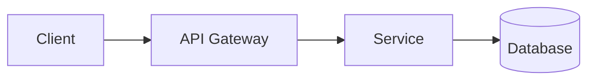
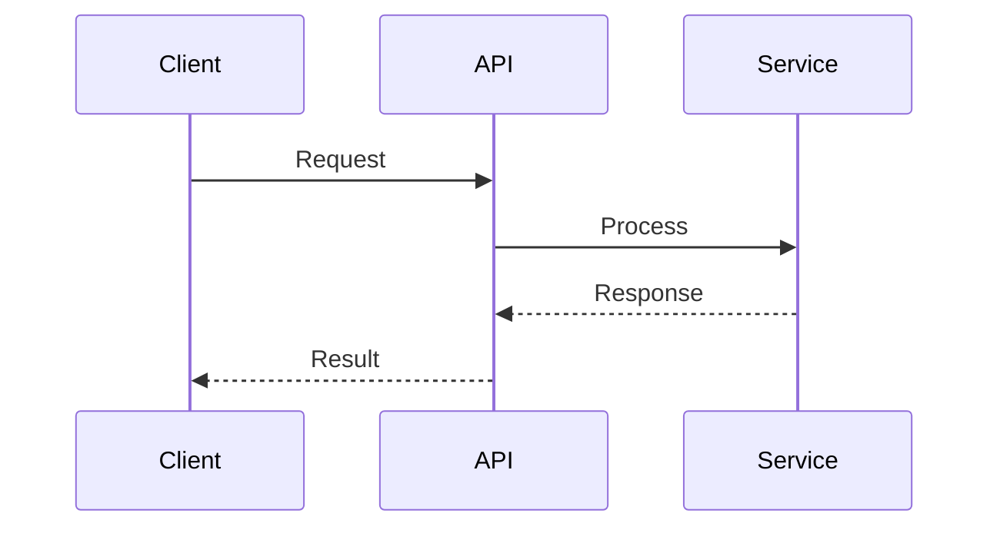
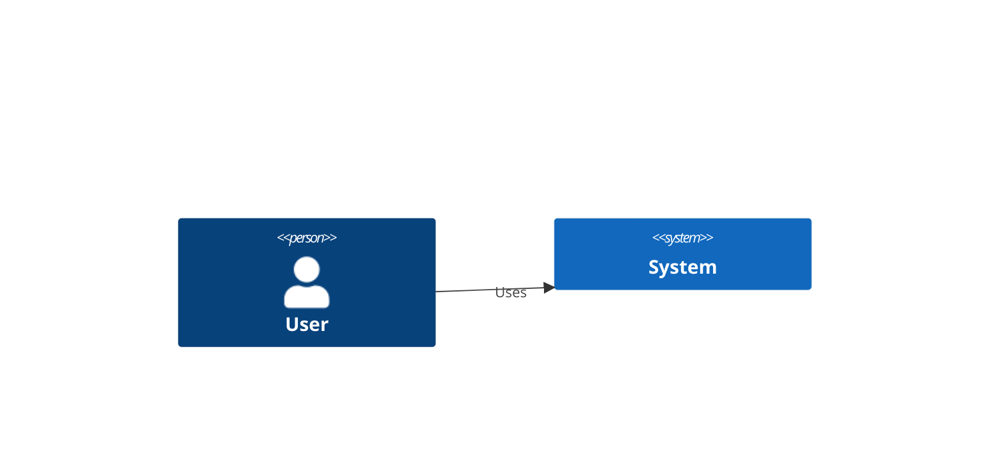

# Copilot Instructions

## Architecture Principles

When creating or reviewing ADRs, validate against these principles:

| Principle | Rule |
|-----------|------|
| Cloud-First | Prefer managed services, design for scale |
| API-First | Expose APIs, use OpenAPI, version APIs |
| Security by Design | Encrypt data, least privilege, no secrets in code |
| Observability | Logs, metrics, traces, health checks |
| Resilience | Circuit breakers, no SPOF, graceful degradation |
| Cost Efficiency | Right-size, auto-scale, prefer serverless |
| Technology Standards | Node.js, Python, Go, React, Swift, Kotlin, PostgreSQL, Redis, Kafka |
| Data Management | GDPR, retention policies, backup procedures |

## ADR Generation Rules

When asked to create an Architecture Decision Record (ADR):

1. **Template**: Use exactly `doc-templates/adr-template.md`
2. **Output Location**: Save to `adr-docs/adr-XXX-kebab-case-title.md`
3. **Auto-fill**:
   - `{{NUMBER}}` → Next sequential number (check existing files in adr-docs/)
   - `{{DATE}}` → Current date (YYYY-MM-DD)
   - `{{STATUS}}` → Draft
   - `{{OWNER}}` → Ewan Peters
   - `{{CATEGORY}}` → Infer from title
   - `{{PRIORITY}}` → Medium (unless specified)
4. **Principles Alignment**: Evaluate decision against architecture principles
5. **Preserve**: Keep all HTML comments from the template
6. **IMPORTANT**: Always include the filepath comment at the top of the code block
7. **Architecture Diagram**: Generate a Mermaid diagram showing the architecture

## Diagram Guidelines

When creating the Architecture Diagram section, use Mermaid syntax:

### Flow Diagram (for data/process flows)

### Sequence Diagram (for interactions)

### C4 Context Diagram (for system context)

Choose the most appropriate diagram type based on the ADR topic.

## Prompt Formats Supported

| Prompt | Action |
|--------|--------|
| `New ADR: [Title]` | Generate ADR with principles alignment |
| `Fill this ADR about: [Title]` | Fill open file with ADR content |
| `Review ADR` | Check active ADR against principles |
| `@adr /new [title]` | Interactive ADR creation |

## Impacts Section Guidelines

When generating the Impacts section, automatically include:

### Teams Impacted
Identify teams based on the ADR category:
- **Infrastructure**: Platform, DevOps, SRE
- **Data**: Data Engineering, Analytics, BI
- **Security**: Security, Compliance
- **Integration**: Backend, API, Integration
- **API**: Frontend, Backend, Mobile
- **Other**: Infer from context

### Systems Impacted
List systems affected based on the decision:
- Upstream systems (data sources)
- Downstream systems (consumers)
- Supporting systems (auth, logging, monitoring)

### Timeline
Generate realistic phases:
- **Phase 1**: Design/Planning (1-2 weeks)
- **Phase 2**: Implementation (2-4 weeks)
- **Phase 3**: Testing/Rollout (1-2 weeks)

### Risks
Identify common risks based on category:
- **Infrastructure**: Downtime, migration complexity, cost overrun
- **Data**: Data loss, consistency issues, performance degradation
- **Security**: Vulnerabilities, compliance gaps
- **Integration**: Breaking changes, backward compatibility
- **API**: Client impact, versioning challenges

## Minimal Prompt Support

If the user provides only a title:
- Context: "To be defined"
- Decision: "To be defined"
- Category: Infer from title or "Other"
- Priority: "Medium"
- Principles Alignment: Evaluate based on title/decision
- Positive/Negative: Leave blank
- Alternatives: "None identified yet"
- Related: "None"
- References: Leave blank
