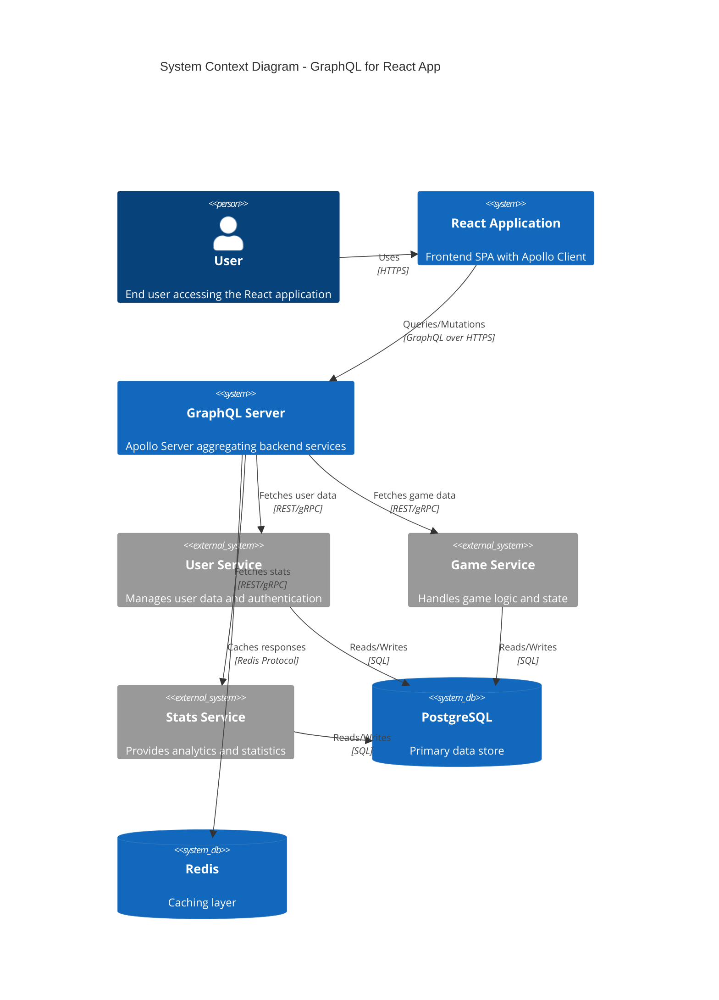

# ADR-016: Changing from REST to GraphQL for React App Updates

## Status
Draft <!-- Draft | Proposed | Accepted | Deprecated | Superseded -->

## Date
2026-04-24

## Owner
Ewan Peters

## Category
API <!-- Infrastructure | Data | Security | Integration | API | Other -->

## Priority
High <!-- High | Medium | Low -->

## Context
<!-- What is the issue that we're seeing that is motivating this decision or change? -->
Our React application currently uses multiple REST endpoints to fetch data, resulting in over-fetching, under-fetching, and multiple round trips to the server. This impacts performance and developer experience, especially for complex views that aggregate data from multiple resources.

## Decision
<!-- What is the change that we're proposing and/or doing? -->
Migrate from REST APIs to GraphQL for the React application. Implement a GraphQL server (Apollo Server) that aggregates existing backend services, allowing the frontend to request exactly the data it needs in a single query.

## Architecture Diagram
<!-- Visualise the architecture using Mermaid C4 syntax -->

## Principles Alignment
<!-- How does this decision align with our architecture principles? -->
| Principle | Alignment | Notes |
|-----------|-----------|-------|
| Cloud-First | ✅ | Can deploy GraphQL server as managed service (AppSync) or container |
| API-First | ✅ | GraphQL schema serves as API contract and documentation |
| Security by Design | ✅ | Field-level authorization, query depth limiting |
| Observability | ✅ | Apollo Studio for tracing, query analytics |
| Resilience | ⚠️ | Need to implement DataLoader for batching, caching |
| Cost Efficiency | ✅ | Reduced bandwidth, fewer API calls |
| Technology Standards | ✅ | React + Apollo Client is industry standard |
| Data Management | ✅ | Schema controls data exposure, no over-fetching |

## Consequences
<!-- What becomes easier or more difficult to do because of this change? -->

### Positive
- Single query fetches all required data (no over-fetching)
- Strongly typed schema improves developer experience
- Built-in documentation via GraphQL introspection
- Real-time updates via GraphQL subscriptions
- Better performance with reduced network requests
- Apollo Client provides caching out of the box

### Negative
- Learning curve for team unfamiliar with GraphQL
- Query complexity can impact server performance
- Need to implement query depth/complexity limiting
- Additional layer between frontend and backend services
- Caching more complex than REST (no HTTP caching)
- Error handling differs from REST conventions

## Alternatives Considered
<!-- What other options were considered? -->
BFF (Backend for Frontend) pattern with REST, JSON:API specification, OData, Keep REST with response shaping

## Related Decisions
<!-- List any related ADRs -->
ADR-014: Changing PUSH to Use AWS AppSync

## References
<!-- Links to relevant documentation, diagrams, etc. -->
- https://graphql.org/
- https://www.apollographql.com/docs/react/
- https://www.apollographql.com/docs/apollo-server/
