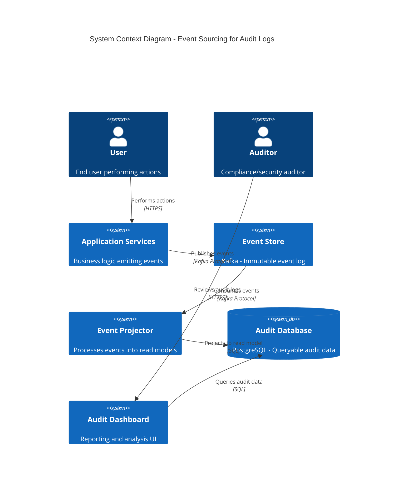

# ADR-017: Implementing Event Sourcing for Audit Logs

## Status
Draft <!-- Draft | Proposed | Accepted | Deprecated | Superseded -->

## Date
2026-04-24

## Owner
Ewan Peters

## Category
Data <!-- Infrastructure | Data | Security | Integration | API | Other -->

## Priority
High <!-- High | Medium | Low -->

## Context
<!-- What is the issue that we're seeing that is motivating this decision or change? -->
Our current audit logging approach stores only the final state of entities, making it difficult to reconstruct the history of changes, meet compliance requirements, and debug issues. We need a complete, immutable record of all state changes for regulatory compliance (GDPR, SOX) and operational visibility.

## Decision
<!-- What is the change that we're proposing and/or doing? -->
Implement event sourcing for audit logs, storing all state changes as an immutable sequence of events. Use Apache Kafka as the event store with long-term retention, and project events into a queryable read model in PostgreSQL for reporting and analysis.

## Architecture Diagram
<!-- Visualise the architecture using Mermaid C4 syntax -->

## Principles Alignment
<!-- How does this decision align with our architecture principles? -->
| Principle | Alignment | Notes |
|-----------|-----------|-------|
| Cloud-First | ✅ | Can use Amazon MSK or Confluent Cloud |
| API-First | ✅ | Event schema registry for contracts |
| Security by Design | ✅ | Immutable logs, encryption, access controls |
| Observability | ✅ | Full history of all state changes |
| Resilience | ✅ | Kafka replication, event replay capability |
| Cost Efficiency | ⚠️ | Storage costs increase with retention |
| Technology Standards | ✅ | Kafka is approved technology |
| Data Management | ✅ | GDPR compliant, configurable retention |

## Impacts
<!-- What areas will be impacted by this decision? -->

### Teams Impacted
- Backend Team (event emission from services)
- Data Engineering Team (event store management)
- Platform/DevOps Team (Kafka infrastructure)
- Security/Compliance Team (audit requirements)
- Analytics Team (reporting dashboards)

### Systems Impacted
- All microservices (upstream - emit events)
- Kafka cluster (new event store)
- PostgreSQL (downstream - read model)
- Audit Dashboard (downstream - reporting)
- Monitoring systems (supporting)

### Timeline
| Phase | Description | Duration |
|-------|-------------|----------|
| Design | Event schema design, infrastructure planning | 2 weeks |
| Implementation | Kafka setup, event emission, projectors | 4 weeks |
| Rollout | Staged rollout, backfill historical data | 2 weeks |

### Risks
| Risk | Likelihood | Impact | Mitigation |
|------|------------|--------|------------|
| Storage costs escalate | Medium | Medium | Tiered storage, retention policies |
| Event schema evolution | High | Medium | Schema registry, versioning strategy |
| Projection lag | Medium | Low | Monitor consumer lag, scale consumers |
| Data privacy concerns | Low | High | Field-level encryption, PII redaction |

## Consequences
<!-- What becomes easier or more difficult to do because of this change? -->

### Positive
- Complete audit trail of all state changes
- Ability to reconstruct state at any point in time
- Compliance with regulatory requirements (GDPR, SOX)
- Debug and root cause analysis simplified
- Event replay for recovery scenarios
- Decoupled read and write models

### Negative
- Increased storage requirements
- Eventual consistency between event store and read model
- Complexity in event schema evolution
- Learning curve for event sourcing patterns
- Need for idempotent event handlers

## Alternatives Considered
<!-- What other options were considered? -->
Database triggers with audit tables, Change Data Capture (CDC) with Debezium, Application-level logging to Elasticsearch, Third-party audit solutions (e.g., Splunk)

## Related Decisions
<!-- List any related ADRs -->
ADR-015: Changing Kafka to SQS (Note: This ADR assumes Kafka is retained for event sourcing)

## References
<!-- Links to relevant documentation, diagrams, etc. -->
- https://martinfowler.com/eaaDev/EventSourcing.html
- https://docs.confluent.io/platform/current/schema-registry/index.html
- https://www.eventstore.com/
