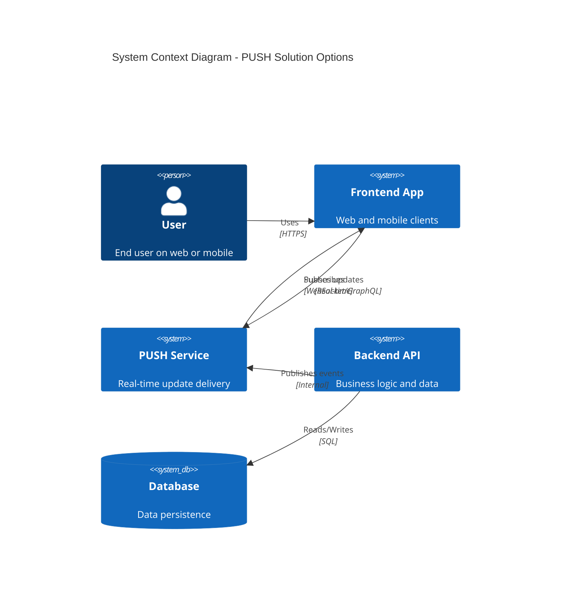

# ADR-018: Replace Polling with PUSH Solution

## Status
Draft <!-- Draft | Proposed | Accepted | Deprecated | Superseded -->

## Date
2026-04-28

## Owner
Ewan Peters

## Category
API <!-- Infrastructure | Data | Security | Integration | API | Other -->

## Priority
High <!-- High | Medium | Low -->

## Context
<!-- What is the issue that we're seeing that is motivating this decision or change? -->
The application currently uses polling to check for updates, which causes unnecessary server load, increased latency, and poor user experience. We need to replace the polling mechanism with a real-time PUSH solution to achieve sub-second updates.

If no decision is made, we continue with inefficient polling, leading to wasted resources, delayed updates, and degraded user experience on both web and mobile clients.

## Decision
<!-- What is the change that we're proposing and/or doing? -->
**No recommendation has been made yet.** This ADR is open for discussion.

Four options are being evaluated to replace polling with a real-time PUSH solution. The final decision will be based on latency requirements, team expertise, and mobile client support.

## Architecture Diagram
<!-- Visualise the architecture using Mermaid C4 syntax -->

## Decision Drivers
<!-- What are the primary constraints shaping this decision? -->
| Driver | Requirement |
|--------|-------------|
| Latency | Sub-second updates |
| Team Expertise | Prefer managed services to reduce operational burden |
| Mobile Support | **Non-negotiable** - must support mobile clients |

## Options Considered
<!-- What options are being evaluated? -->

### Option 1: WebSockets

| Pros | Cons |
|------|------|
| ✅ Good, because it provides bidirectional communication | ❌ Bad, because connection management is complex |
| ✅ Good, because it has wide browser and mobile support | ❌ Bad, because stateful connections create scaling challenges |
| ✅ Good, because it offers low latency | ❌ Bad, because firewalls and proxies can block connections |

### Option 2: Server-Sent Events (SSE)

| Pros | Cons |
|------|------|
| ✅ Good, because it is simple and HTTP-based | ❌ Bad, because it is unidirectional only |
| ✅ Good, because auto-reconnect is built-in | ❌ Bad, because mobile support is limited |
| ✅ Good, because no special infrastructure is needed | ❌ Bad, because connection limits per domain apply |

### Option 3: AWS AppSync

| Pros | Cons |
|------|------|
| ✅ Good, because it is a fully managed service | ❌ Bad, because it creates vendor lock-in to AWS |
| ✅ Good, because GraphQL subscriptions are built-in | ❌ Bad, because there is a learning curve for GraphQL |
| ✅ Good, because it has excellent mobile support via Amplify | ❌ Bad, because cost can increase at high volume |
| ✅ Good, because authentication is built-in via Cognito | |

### Option 4: Firebase Realtime Database

| Pros | Cons |
|------|------|
| ✅ Good, because it has excellent mobile SDKs | ❌ Bad, because it creates vendor lock-in to Google |
| ✅ Good, because offline support is included | ❌ Bad, because query capabilities are limited |
| ✅ Good, because setup is easy | ❌ Bad, because cost can escalate at scale |

## Principles Alignment
<!-- How does this decision align with our architecture principles? -->
| Principle | Alignment | Notes |
|-----------|-----------|-------|
| Cloud-First | ✅ | All options support cloud deployment; AppSync and Firebase are fully managed |
| API-First | ✅ | PUSH APIs will be documented with subscription contracts |
| Security by Design | ✅ | All options support TLS; AppSync/Firebase have built-in auth |
| Observability | ⚠️ | Need to ensure metrics and tracing for PUSH connections |
| Resilience | ⚠️ | Fallback to polling recommended if PUSH fails |
| Cost Efficiency | ⚠️ | Managed services (AppSync, Firebase) have usage-based pricing |
| Technology Standards | ✅ | WebSockets and AppSync align with approved stack |
| Data Management | ✅ | No PII in PUSH messages |

## Impacts
<!-- What areas will be impacted by this decision? -->

### Teams Impacted
- Frontend Team (web and mobile clients)
- Backend Team (event publishing)
- Platform/DevOps Team (infrastructure)

### Systems Impacted
- Frontend App (upstream consumer)
- Backend API (event publisher)
- PUSH Service (new component)
- Monitoring systems (supporting)

### Timeline
| Phase | Description | Duration |
|-------|-------------|----------|
| Evaluation | POC for top 2 options | 2 weeks |
| Design | Architecture and contracts | 1 week |
| Implementation | Build and integrate | 3-4 weeks |
| Rollout | Staged deployment, monitoring | 2 weeks |

### Risks
| Risk | Likelihood | Impact | Mitigation |
|------|------------|--------|------------|
| Vendor lock-in | Medium | Medium | Abstract PUSH interface for portability |
| Connection scalability | Medium | High | Load testing, auto-scaling |
| Mobile client compatibility | Low | High | POC on iOS and Android early |
| Cost overrun | Medium | Medium | Monitor usage, set alerts |

## Consequences
<!-- What becomes easier or more difficult to do because of this change? -->

### Positive
- ✅ Good, because users receive real-time updates with sub-second latency
- ✅ Good, because server load is reduced (no polling overhead)
- ✅ Good, because user experience improves on web and mobile
- ✅ Good, because bandwidth usage is more efficient

### Negative
- ❌ Bad, because additional infrastructure complexity is introduced
- ❌ Bad, because team needs to learn new technology
- ❌ Bad, because fallback mechanism to polling is still needed
- ❌ Bad, because managed services may increase costs

## Alternatives Considered
<!-- What other options were considered? -->
WebSockets, Server-Sent Events (SSE), AWS AppSync, Firebase Realtime Database

## Related Decisions
<!-- List any related ADRs -->
- ADR-011: PUSH Solution for Front-End Gamestate
- ADR-014: Changing PUSH to Use AWS AppSync

## References
<!-- Links to relevant documentation, diagrams, etc. -->
- https://aws.amazon.com/appsync/
- https://firebase.google.com/docs/database
- https://developer.mozilla.org/en-US/docs/Web/API/WebSockets_API
- https://developer.mozilla.org/en-US/docs/Web/API/Server-sent_events
