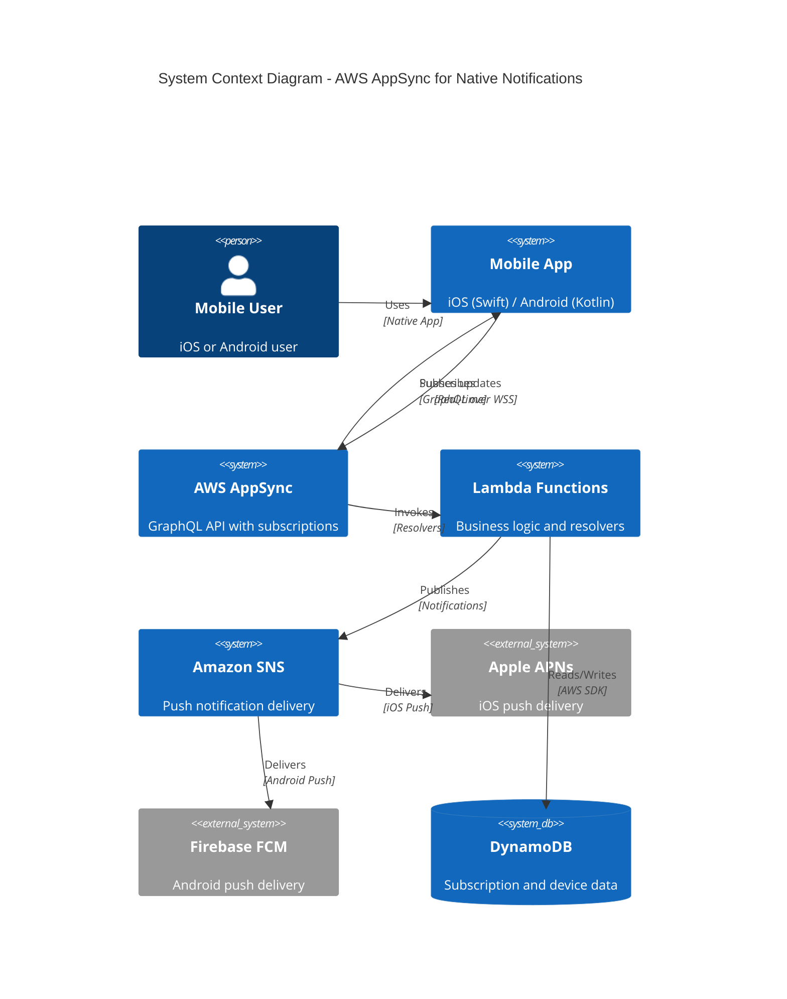

# ADR-019: Implementing AWS AppSync for Native Notifications

## Status
Draft <!-- Draft | Proposed | Accepted | Deprecated | Superseded -->

## Date
2026-04-28

## Owner
Ewan Peters

## Category
Integration <!-- Infrastructure | Data | Security | Integration | API | Other -->

## Priority
High <!-- High | Medium | Low -->

## Context
<!-- What is the issue that we're seeing that is motivating this decision or change? -->
We need a robust, scalable solution for delivering native push notifications to iOS and Android mobile applications. The current approach lacks real-time capabilities and requires significant custom infrastructure to manage device tokens, message routing, and delivery guarantees.

AWS AppSync provides managed GraphQL subscriptions that integrate seamlessly with mobile clients via AWS Amplify, offering a unified approach for both real-time data sync and native notifications.

## Decision
<!-- What is the change that we're proposing and/or doing? -->
Implement AWS AppSync as the backbone for native notifications on iOS and Android. AppSync will handle real-time subscriptions, with integration to Amazon SNS for platform-specific push notification delivery (APNs for iOS, FCM for Android).

## Architecture Diagram
<!-- Visualise the architecture using Mermaid C4 syntax -->

## Principles Alignment
<!-- How does this decision align with our architecture principles? -->
| Principle | Alignment | Notes |
|-----------|-----------|-------|
| Cloud-First | ✅ | Fully managed AWS services (AppSync, SNS, Lambda) |
| API-First | ✅ | GraphQL schema serves as API contract |
| Security by Design | ✅ | Cognito authentication, IAM policies, encrypted connections |
| Observability | ✅ | CloudWatch metrics, X-Ray tracing, SNS delivery logs |
| Resilience | ✅ | Multi-AZ, automatic retries, dead-letter queues |
| Cost Efficiency | ✅ | Pay-per-request, no idle infrastructure |
| Technology Standards | ✅ | Swift (iOS) and Kotlin (Android) with Amplify SDK |
| Data Management | ✅ | Device tokens managed securely, no PII in notifications |

## Impacts
<!-- What areas will be impacted by this decision? -->

### Teams Impacted
- Mobile Team (iOS and Android integration)
- Backend Team (Lambda resolvers, SNS configuration)
- Platform/DevOps Team (AWS infrastructure)
- Security Team (Cognito, IAM policies)

### Systems Impacted
- iOS Mobile App (upstream consumer)
- Android Mobile App (upstream consumer)
- AWS AppSync (new component)
- Amazon SNS (notification delivery)
- AWS Lambda (business logic)
- Amazon DynamoDB (device/subscription data)

### Timeline
| Phase | Description | Duration |
|-------|-------------|----------|
| Design | Schema design, SNS topic structure | 1 week |
| Implementation | AppSync setup, Lambda resolvers, mobile integration | 3 weeks |
| Testing | End-to-end testing on iOS and Android | 1 week |
| Rollout | Staged rollout, monitoring | 1 week |

### Risks
| Risk | Likelihood | Impact | Mitigation |
|------|------------|--------|------------|
| Vendor lock-in to AWS | Medium | Medium | Abstract notification interface |
| APNs/FCM credential management | Low | High | Secure storage in Secrets Manager |
| Notification delivery failures | Low | Medium | SNS delivery status logging, retries |
| Cost at high volume | Medium | Medium | Monitor usage, set billing alerts |

## Consequences
<!-- What becomes easier or more difficult to do because of this change? -->

### Positive
- ✅ Good, because native notifications are delivered reliably to iOS and Android
- ✅ Good, because Amplify SDK simplifies mobile integration
- ✅ Good, because GraphQL subscriptions provide real-time updates in-app
- ✅ Good, because managed services reduce operational overhead
- ✅ Good, because authentication is unified via Cognito
- ✅ Good, because observability is built-in with CloudWatch and X-Ray

### Negative
- ❌ Bad, because there is vendor lock-in to AWS ecosystem
- ❌ Bad, because team needs to learn GraphQL and Amplify
- ❌ Bad, because debugging cross-service issues can be complex
- ❌ Bad, because APNs and FCM credentials require careful management

## Alternatives Considered
<!-- What other options were considered? -->
Firebase Cloud Messaging (standalone), OneSignal, Pusher Beams, Custom WebSocket + SNS solution

## Related Decisions
<!-- List any related ADRs -->
- ADR-014: Changing PUSH to Use AWS AppSync
- ADR-018: Replace Polling with PUSH Solution

## References
<!-- Links to relevant documentation, diagrams, etc. -->
- https://aws.amazon.com/appsync/
- https://docs.amplify.aws/lib/push-notifications/getting-started/
- https://aws.amazon.com/sns/
- https://developer.apple.com/documentation/usernotifications
- https://firebase.google.com/docs/cloud-messaging
