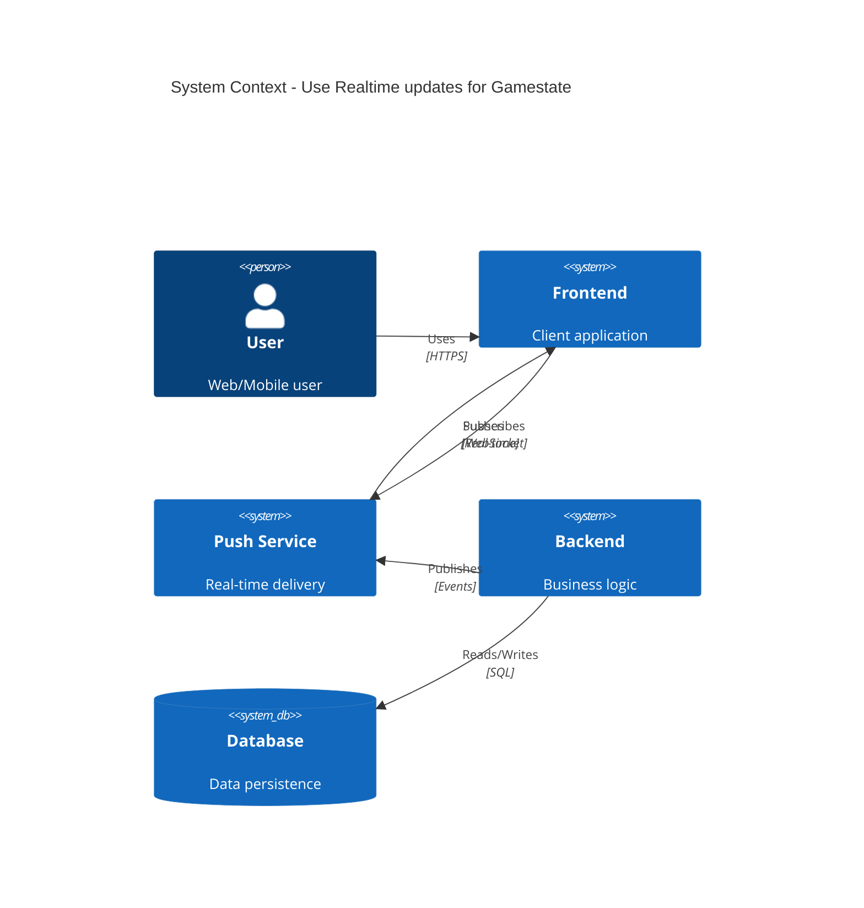

# ADR-020: Use Real-time updates for Gamestate

## Status
Draft <!-- Draft | Proposed | Accepted | Deprecated | Superseded -->

## Date
2026-04-28

## Owner
Ewan Peters

## Category
Other <!-- Infrastructure | Data | Security | Integration | API | Other -->

## Priority
High <!-- High | Medium | Low -->

## Context
<!-- What is the issue that we're seeing that is motivating this decision or change? -->
Make the updates to the front-end apps real-time. Currently the updates are done witl POLLING. If this is not done then updates will remain slow

Front end and Back-end. Front-end and BFF teams. Only gamestate

## Decision
<!-- What is the change that we're proposing and/or doing? -->
Use WebSockets. High

## Architecture Diagram
<!-- Visualise the architecture using Mermaid C4 syntax -->

## Principles Alignment
<!-- How does this decision align with our architecture principles? -->
| Principle | Alignment | Notes |
|-----------|-----------|-------|
| Cloud-First | ✅ |  |
| API-First | ✅ |  |
| Security by Design | ✅ |  |
| Observability | ⚠️ | Review needed |
| Resilience | ⚠️ | Review needed |
| Cost Efficiency | ✅ |  |
| Technology Standards | ✅ |  |
| Data Management | ✅ |  |

## Impacts
<!-- What areas will be impacted by this decision? -->

### Teams Impacted
- Frontend Team
- Backend Team
- Mobile Team

### Systems Impacted
- To be identified

### Timeline
| Phase | Description | Duration |
|-------|-------------|----------|
| Design | Architecture and planning | 1-2 weeks |
| Implementation | Development and testing | 2-4 weeks |
| Rollout | Staged deployment | 1-2 weeks |

### Risks
| Risk | Likelihood | Impact | Mitigation |
|------|------------|--------|------------|
| Connection scalability | Medium | High | Load testing, auto-scaling |
| Mobile network issues | Medium | Medium | Reconnection logic, fallback |

## Consequences
<!-- What becomes easier or more difficult to do because of this change? -->

### Positive
- ✅ Good, because go to step 6/6

### Negative
- To be defined

## Alternatives Considered
<!-- What other options were considered? -->
List all the options

## Related Decisions
<!-- List any related ADRs -->
None

## References
<!-- Links to relevant documentation, diagrams, etc. -->

