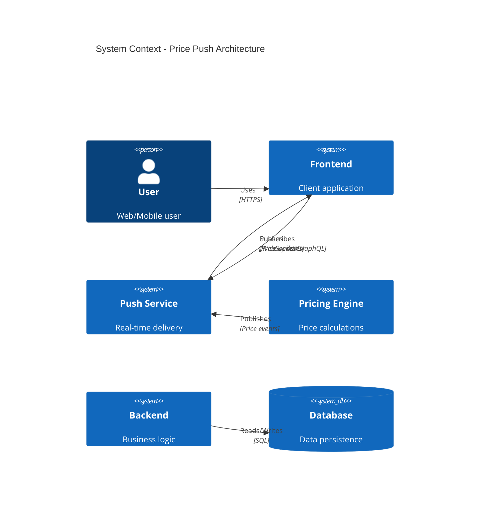

# ADR-021: Replace Polling with Push for Prices

## Status
Draft <!-- Draft | Proposed | Accepted | Deprecated | Superseded -->

## Date
2026-04-28

## Owner
Ewan Peters

## Category
Integration <!-- Infrastructure | Data | Security | Integration | API | Other -->

## Priority
High <!-- High | Medium | Low -->

## Context
<!-- What is the issue that we're seeing that is motivating this decision or change? -->
Currently, the front-end applications retrieve price updates using a polling mechanism. This approach has several limitations:

- **Latency**: Prices are only as fresh as the polling interval (typically 5-30 seconds)
- **Server load**: Constant polling creates unnecessary load on backend services
- **Battery/bandwidth**: Mobile clients consume more resources with frequent polling
- **User experience**: Users may see stale prices, leading to poor trading decisions
- **Scalability**: As user base grows, polling traffic grows linearly

We need to replace this with a push-based solution to deliver real-time price updates to clients.

## Decision
<!-- What is the change that we're proposing and/or doing? -->
Evaluate and implement a push-based solution for delivering real-time price updates to front-end applications. The recommended approach is to use **WebSockets** or **AWS AppSync** for managed GraphQL subscriptions.

## Architecture Diagram
<!-- Visualise the architecture using Mermaid C4 syntax -->

## Options Considered

### Option 1: WebSockets (Native)
Direct WebSocket connections from clients to backend services.

| Pros | Cons |
|------|------|
| ✅ Full bidirectional communication | ❌ Connection management complexity |
| ✅ Low latency | ❌ Requires custom scaling infrastructure |
| ✅ Wide browser support | ❌ Stateful connections harder to load balance |
| ✅ No vendor lock-in | ❌ More development effort |

### Option 2: AWS AppSync (GraphQL Subscriptions)
Managed GraphQL service with built-in real-time subscriptions.

| Pros | Cons |
|------|------|
| ✅ Fully managed, auto-scaling | ❌ AWS vendor lock-in |
| ✅ Built-in auth integration (Cognito) | ❌ Cost per message/connection |
| ✅ GraphQL schema consistency | ❌ Learning curve for team |
| ✅ Offline support for mobile | ❌ Less control over infrastructure |

### Option 3: Server-Sent Events (SSE)
One-way push from server to client over HTTP.

| Pros | Cons |
|------|------|
| ✅ Simple implementation | ❌ One-way only (server to client) |
| ✅ Works through firewalls/proxies | ❌ Limited browser connection pool |
| ✅ Auto-reconnection built-in | ❌ No binary data support |
| ✅ HTTP/2 compatible | ❌ Less efficient than WebSockets |

### Option 4: Firebase Realtime Database / Firestore
Google's managed real-time database with built-in sync.

| Pros | Cons |
|------|------|
| ✅ Easy to implement | ❌ Google vendor lock-in |
| ✅ Offline support | ❌ May not fit existing architecture |
| ✅ Cross-platform SDKs | ❌ Data model constraints |
| ✅ Auto-scaling | ❌ Cost at scale |

### Option 5: Socket.io
Popular WebSocket library with fallbacks.

| Pros | Cons |
|------|------|
| ✅ Automatic fallback mechanisms | ❌ Additional library dependency |
| ✅ Room/namespace support | ❌ Self-managed infrastructure |
| ✅ Large community | ❌ Can add overhead vs native WS |
| ✅ Easy to implement | ❌ May be overkill for simple push |

## Principles Alignment
<!-- How does this decision align with our architecture principles? -->
| Principle | Alignment | Notes |
|-----------|-----------|-------|
| Cloud-First | ✅ | AWS AppSync is fully managed |
| API-First | ✅ | GraphQL subscriptions provide clear contracts |
| Security by Design | ✅ | Auth integration with Cognito/JWT |
| Observability | ⚠️ | Need to implement subscription metrics |
| Resilience | ✅ | Managed services handle failover |
| Cost Efficiency | ⚠️ | Pay-per-message model needs analysis |
| Technology Standards | ✅ | WebSockets/GraphQL are standard |
| Data Management | ✅ | No PII in price data |

## Impacts
<!-- What areas will be impacted by this decision? -->

### Teams Impacted
- Frontend Team
- Backend Team
- Mobile Team
- Platform Team

### Systems Impacted
- Web application
- iOS application
- Android application
- Pricing service
- API Gateway

### Timeline
| Phase | Description | Duration |
|-------|-------------|----------|
| Design | Architecture and planning | 1-2 weeks |
| POC | Proof of concept with selected option | 2 weeks |
| Implementation | Development and testing | 3-4 weeks |
| Rollout | Staged deployment | 1-2 weeks |

### Risks
| Risk | Likelihood | Impact | Mitigation |
|------|------------|--------|------------|
| Connection scalability | Medium | High | Load testing, auto-scaling |
| Mobile network issues | Medium | Medium | Reconnection logic, fallback to polling |
| Cost overrun | Medium | Medium | Usage monitoring, budget alerts |
| Migration complexity | Low | Medium | Phased rollout, feature flags |

## Consequences
<!-- What becomes easier or more difficult to do because of this change? -->

### Positive
- ✅ Good, because users receive price updates in real-time (sub-second latency)
- ✅ Good, because server load is reduced (no constant polling)
- ✅ Good, because mobile battery and bandwidth usage improves
- ✅ Good, because user experience is significantly better
- ✅ Good, because architecture is more scalable

### Negative
- ❌ Bad, because we need to manage WebSocket connections
- ❌ Bad, because there's additional infrastructure complexity
- ❌ Bad, because we need fallback mechanisms for unreliable networks
- ❌ Bad, because debugging real-time issues is harder than REST

## Recommendation

**Recommended Option: AWS AppSync (Option 2)**

For the following reasons:
1. **Managed service** - Reduces operational burden
2. **GraphQL consistency** - Aligns with potential API modernization
3. **Mobile support** - Built-in offline/reconnection for native apps
4. **Security** - Integrates with existing Cognito authentication
5. **Scalability** - Auto-scales without infrastructure changes

**Alternative: WebSockets (Option 1)** if we need more control or want to avoid vendor lock-in.

## Related Decisions
- ADR-018: Replace polling with push solution
- ADR-019: Implementing AWS AppSync for native notifications
- ADR-020: Use real-time updates for gamestate

## References
- [AWS AppSync Documentation](https://docs.aws.amazon.com/appsync/)
- [WebSocket API](https://developer.mozilla.org/en-US/docs/Web/API/WebSockets_API)
- [GraphQL Subscriptions](https://graphql.org/blog/subscriptions-in-graphql-and-relay/)
