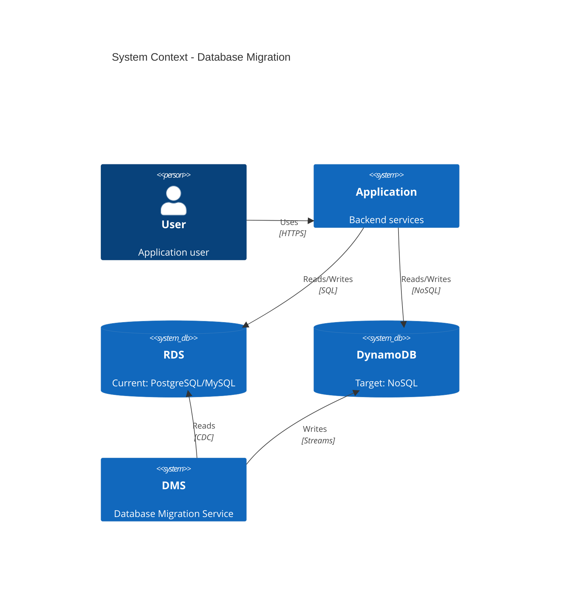

# ADR-022: Migrate Backend DB from RDS to DynamoDB

## Status
Draft <!-- Draft | Proposed | Accepted | Deprecated | Superseded -->

## Date
2026-04-28

## Owner
Ewan Peters

## Category
Data <!-- Infrastructure | Data | Security | Integration | API | Other -->

## Priority
High <!-- High | Medium | Low -->

## Context
<!-- What is the issue that we're seeing that is motivating this decision or change? -->
The current backend database is running on Amazon RDS (PostgreSQL/MySQL). We are evaluating a migration to Amazon DynamoDB for the following reasons:

**Current State:**
- RDS instance requires ongoing maintenance (patching, upgrades)
- Scaling requires manual intervention or scheduled scaling windows
- Read replicas add complexity and cost
- Fixed provisioned capacity leads to over-provisioning for variable workloads
- Connection pooling limits under high concurrency

**Drivers for Change:**
- Need for automatic scaling to handle traffic spikes
- Desire to reduce operational overhead
- Cost optimization for variable workloads
- Microsecond latency requirements for certain access patterns
- Simplified data model suits key-value/document patterns

## Decision
<!-- What is the change that we're proposing and/or doing? -->
Evaluate migration options from RDS to DynamoDB, considering the trade-offs between different database technologies and migration strategies.

## Architecture Diagram
<!-- Visualise the architecture using Mermaid syntax -->

## Options Considered

### Option 1: Full Migration to DynamoDB
Migrate all data and workloads from RDS to DynamoDB.

| Pros | Cons |
|------|------|
| ✅ Fully managed, serverless | ❌ Requires data model redesign |
| ✅ Auto-scaling (on-demand capacity) | ❌ No SQL support (limited queries) |
| ✅ Single-digit millisecond latency | ❌ Complex transactions limited |
| ✅ Built-in replication and backup | ❌ Learning curve for team |
| ✅ Pay-per-request pricing option | ❌ Hot partition risks |

**Best for:** High-scale, key-value access patterns, variable traffic

### Option 2: Stay with RDS (Optimise Current Setup)
Keep RDS but optimise for performance and cost.

| Pros | Cons |
|------|------|
| ✅ No migration effort | ❌ Ongoing maintenance overhead |
| ✅ Full SQL capabilities | ❌ Manual scaling required |
| ✅ Team already experienced | ❌ Connection limits under load |
| ✅ Complex queries supported | ❌ Fixed provisioned costs |
| ✅ ACID transactions | ❌ Read replica complexity |

**Best for:** Complex relational data, heavy SQL usage, existing expertise

### Option 3: Aurora Serverless v2
Migrate from RDS to Aurora Serverless for auto-scaling SQL.

| Pros | Cons |
|------|------|
| ✅ Auto-scaling (0.5 to 128 ACUs) | ❌ Higher per-ACU cost than RDS |
| ✅ Full PostgreSQL/MySQL compatibility | ❌ Still requires connection management |
| ✅ Minimal code changes | ❌ Cold start latency possible |
| ✅ Pay for capacity used | ❌ Scaling has some lag |
| ✅ Familiar SQL interface | ❌ Not truly serverless like DynamoDB |

**Best for:** SQL workloads needing auto-scaling, minimal migration effort

### Option 4: Hybrid Approach (RDS + DynamoDB)
Keep RDS for relational data, use DynamoDB for high-scale access patterns.

| Pros | Cons |
|------|------|
| ✅ Best of both worlds | ❌ Two databases to manage |
| ✅ Gradual migration path | ❌ Data synchronisation complexity |
| ✅ Optimised for each use case | ❌ Higher overall complexity |
| ✅ Lower risk | ❌ Potential data consistency issues |
| ✅ Team can learn incrementally | ❌ Increased infrastructure cost |

**Best for:** Mixed workloads, risk-averse migration, learning DynamoDB

### Option 5: Migrate to DocumentDB (MongoDB-compatible)
Use Amazon DocumentDB for document-based workloads.

| Pros | Cons |
|------|------|
| ✅ Flexible document model | ❌ Not fully MongoDB compatible |
| ✅ Managed service | ❌ Still requires provisioned capacity |
| ✅ Familiar to MongoDB users | ❌ Less mature than DynamoDB |
| ✅ Rich query capabilities | ❌ Higher cost than DynamoDB |
| ✅ JSON document support | ❌ Scaling less seamless |

**Best for:** MongoDB workloads, document-oriented data, rich queries

## Principles Alignment
<!-- How does this decision align with our architecture principles? -->
| Principle | Alignment | Notes |
|-----------|-----------|-------|
| Cloud-First | ✅ | DynamoDB is fully managed AWS service |
| API-First | ✅ | Data access via service APIs |
| Security by Design | ✅ | Encryption at rest/transit, IAM policies |
| Observability | ✅ | CloudWatch metrics, X-Ray tracing |
| Resilience | ✅ | Multi-AZ, automatic failover |
| Cost Efficiency | ✅ | On-demand pricing, pay-per-use |
| Technology Standards | ⚠️ | Team needs DynamoDB training |
| Data Management | ✅ | Point-in-time recovery, backups |

## Impacts
<!-- What areas will be impacted by this decision? -->

### Teams Impacted
- Backend Team
- Data Engineering Team
- DevOps/Platform Team
- QA Team

### Systems Impacted
- Backend API services
- Data access layer / ORM
- Reporting and analytics
- Backup and recovery systems
- Monitoring and alerting

### Timeline
| Phase | Description | Duration |
|-------|-------------|----------|
| Assessment | Data model analysis, access pattern review | 2 weeks |
| POC | Proof of concept with subset of data | 2-3 weeks |
| Design | DynamoDB table design, GSI/LSI planning | 2 weeks |
| Migration | Data migration using DMS or custom scripts | 3-4 weeks |
| Testing | Performance testing, validation | 2 weeks |
| Cutover | Gradual traffic shift, monitoring | 1-2 weeks |

### Risks
| Risk | Likelihood | Impact | Mitigation |
|------|------------|--------|------------|
| Data model incompatibility | Medium | High | Thorough access pattern analysis |
| Performance regression | Medium | High | Load testing, gradual rollout |
| Data loss during migration | Low | Critical | DMS validation, backups, dual-write |
| Team skill gap | Medium | Medium | Training, documentation, POC |
| Cost increase (unexpected) | Medium | Medium | Cost monitoring, capacity planning |
| Hot partitions | Medium | High | Partition key design review |

## Consequences
<!-- What becomes easier or more difficult to do because of this change? -->

### Positive
- ✅ Good, because auto-scaling handles traffic spikes automatically
- ✅ Good, because operational overhead is significantly reduced
- ✅ Good, because single-digit millisecond latency improves UX
- ✅ Good, because on-demand pricing aligns cost with usage
- ✅ Good, because built-in replication improves resilience
- ✅ Good, because no connection pool limits

### Negative
- ❌ Bad, because complex SQL queries must be redesigned
- ❌ Bad, because team needs to learn new data modelling patterns
- ❌ Bad, because reporting/analytics may need separate solution
- ❌ Bad, because transactions are limited (25 items max)
- ❌ Bad, because data migration carries risk
- ❌ Bad, because vendor lock-in to AWS increases

## Recommendation

**Recommended Option: Option 4 - Hybrid Approach (RDS + DynamoDB)**

Start with a hybrid approach for the following reasons:

1. **Lower risk** - Keep critical relational data in RDS while moving high-scale patterns to DynamoDB
2. **Gradual learning** - Team can build DynamoDB expertise incrementally
3. **Validate patterns** - Prove DynamoDB works for specific use cases before full migration
4. **Reversible** - Can fall back if issues arise

**Suggested Migration Order:**
1. Session/cache data → DynamoDB (low risk, high benefit)
2. User preferences/settings → DynamoDB
3. High-read access patterns → DynamoDB
4. Evaluate full migration after 3-6 months

**Alternative:** If simplicity is paramount and the team is ready, **Option 1 (Full Migration)** provides the cleanest long-term architecture.

## Related Decisions
<!-- List any related ADRs - add links to relevant decisions -->

| ADR | Title | Link |
|-----|-------|------|
| ADR-004 | Using Redis for Session Caching | [adr-004](./adr-004-using-redis-for-session-caching.md) |
| ADR-012 | Serverless Microservice | [adr-012](./adr-012-serverless-microservice.md) |
| ADR-015 | Changing Kafka to SQS | [adr-015](./adr-015-changing-kafka-to-sqs.md) |

## References
<!-- Links to relevant documentation, diagrams, etc. -->
- [Amazon DynamoDB Documentation](https://docs.aws.amazon.com/dynamodb/)
- [DynamoDB Best Practices](https://docs.aws.amazon.com/amazondynamodb/latest/developerguide/best-practices.html)
- [AWS Database Migration Service](https://docs.aws.amazon.com/dms/)
- [Aurora Serverless v2](https://docs.aws.amazon.com/AmazonRDS/latest/AuroraUserGuide/aurora-serverless-v2.html)
- [DynamoDB Single-Table Design](https://www.alexdebrie.com/posts/dynamodb-single-table/)
