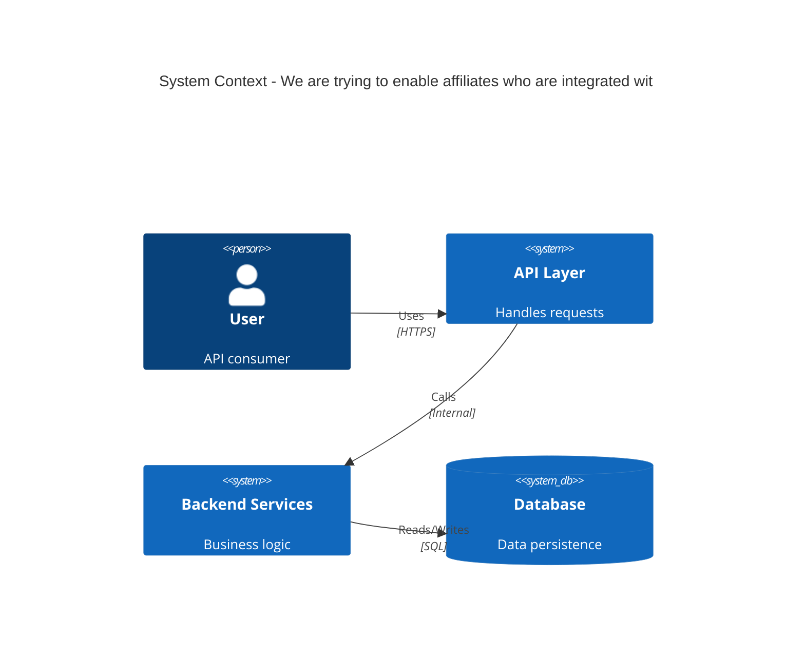

# ADR-023: We are trying to enable affiliates who are integrated wit...

## Status
Draft <!-- Draft | Proposed | Accepted | Deprecated | Superseded -->

## Date
2026-04-29

## Owner
Ewan Peters

## Category
Other <!-- Infrastructure | Data | Security | Integration | API | Other -->

## Priority
High <!-- High | Medium | Low -->

## Context
<!-- What is the issue that we're seeing that is motivating this decision or change? -->
We are trying to enable affiliates who are integrated with the front-end to show content and pricing which includes any pricing experimentation being used.
Currently if affiliates use the FOE API then prices which are shown are related to the affiliate and not the customer.
If we leave this as-is we run the risk of showing incorrect pricing

Front-End (web, and native), BFF, FOE API
Front-End, FOE API team
Sports Discovery and Bet Lifecycle

## Decision
<!-- What is the change that we're proposing and/or doing? -->
Modify the ImplyBets request to FOE API
High

## Architecture Diagram
<!-- Visualise the architecture using Mermaid C4 syntax -->

## Principles Alignment
<!-- How does this decision align with our architecture principles? -->
| Principle | Alignment | Notes |
|-----------|-----------|-------|
| Cloud-First | ✅ |  |
| API-First | ✅ |  |
| Security by Design | ✅ |  |
| Observability | ⚠️ | Review needed |
| Resilience | ⚠️ | Review needed |
| Cost Efficiency | ✅ |  |
| Technology Standards | ✅ |  |
| Data Management | ✅ |  |

## Impacts
<!-- What areas will be impacted by this decision? -->

### Teams Impacted
- Frontend Team
- Backend Team
- Mobile Team

### Systems Impacted
- To be identified

### Timeline
| Phase | Description | Duration |
|-------|-------------|----------|
| Design | Architecture and planning | 1-2 weeks |
| Implementation | Development and testing | 2-4 weeks |
| Rollout | Staged deployment | 1-2 weeks |

### Risks
| Risk | Likelihood | Impact | Mitigation |
|------|------------|--------|------------|
| Breaking changes for clients | Medium | High | API versioning strategy |
| Performance degradation | Low | Medium | Load testing, caching |

## Consequences
<!-- What becomes easier or more difficult to do because of this change? -->

### Positive
- ✅ Good, because 5/6

### Negative
- To be defined

## Alternatives Considered
<!-- What other options were considered? -->
Modify the ImplyBets request to FOE to include the vid. This way customers can be identified

## Related Decisions
<!-- List any related ADRs -->
None

## References
<!-- Links to relevant documentation, diagrams, etc. -->

