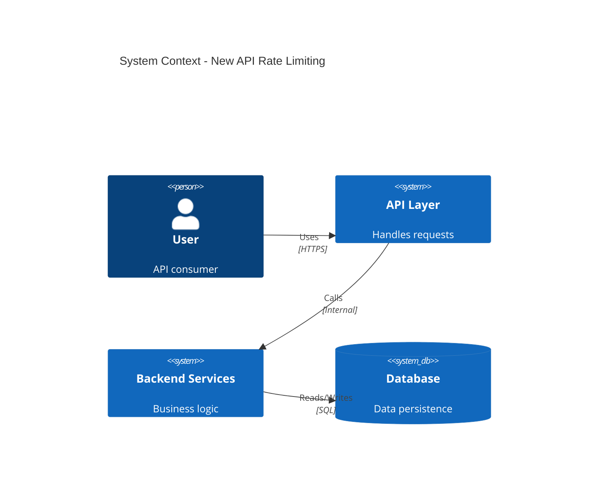

# ADR-027: New API Rate Limiting

## Status
Draft <!-- Draft | Proposed | Accepted | Deprecated | Superseded -->

## Date
2026-05-15

## Owner
Ewan Peters

## Category
API <!-- Infrastructure | Data | Security | Integration | API | Other -->

## Priority
Medium <!-- High | Medium | Low -->

## Context
<!-- What is the issue that we're seeing that is motivating this decision or change? -->
New API Rate Limiting

APIs

## Decision
<!-- What is the change that we're proposing and/or doing? -->
No recommendation yet

## Architecture Diagram
<!-- Visualise the architecture using Mermaid C4 syntax -->

## Principles Alignment
<!-- How does this decision align with our architecture principles? -->
| Principle | Alignment | Notes |
|-----------|-----------|-------|
| Cloud-First | ✅ |  |
| API-First | ✅ |  |
| Security by Design | ✅ |  |
| Observability | ⚠️ | Review needed |
| Resilience | ⚠️ | Review needed |
| Cost Efficiency | ✅ |  |
| Technology Standards | ✅ |  |
| Data Management | ✅ |  |

## Impacts
<!-- What areas will be impacted by this decision? -->

### Teams Impacted
- Frontend Team
- Backend Team
- Mobile Team

### Systems Impacted
- To be identified

### Timeline
| Phase | Description | Duration |
|-------|-------------|----------|
| Design | Architecture and planning | 1-2 weeks |
| Implementation | Development and testing | 2-4 weeks |
| Rollout | Staged deployment | 1-2 weeks |

### Risks
| Risk | Likelihood | Impact | Mitigation |
|------|------------|--------|------------|
| Breaking changes for clients | Medium | High | API versioning strategy |
| Performance degradation | Low | Medium | Load testing, caching |

## Consequences
<!-- What becomes easier or more difficult to do because of this change? -->

### Positive
- ✅ Good, because wide adoption

### Negative
- To be defined

## Alternatives Considered
<!-- What other options were considered? -->
SSE

## Related Decisions
<!-- List any related ADRs -->
None

## Related Repositories
<!-- GitHub repositories relevant to this decision for code review and context -->
| Repository | Purpose | Key Files/Folders |
|------------|---------|-------------------|
| None specified | - | - |

## References
<!-- Links to relevant documentation, diagrams, etc. -->

