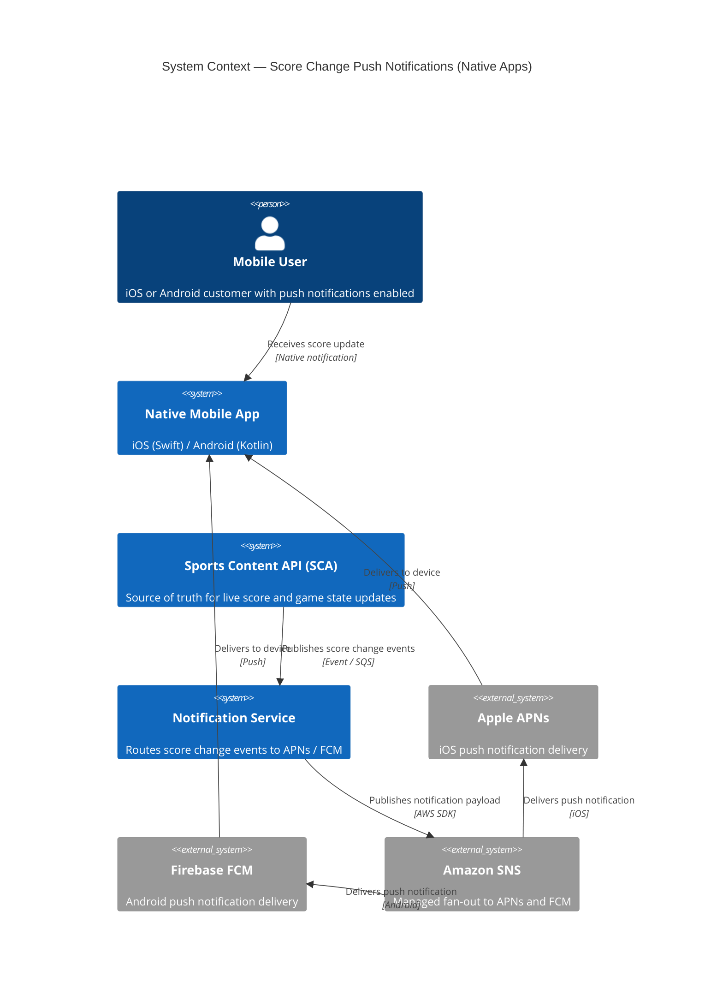
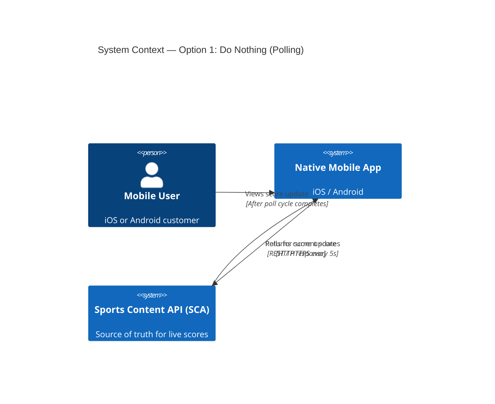
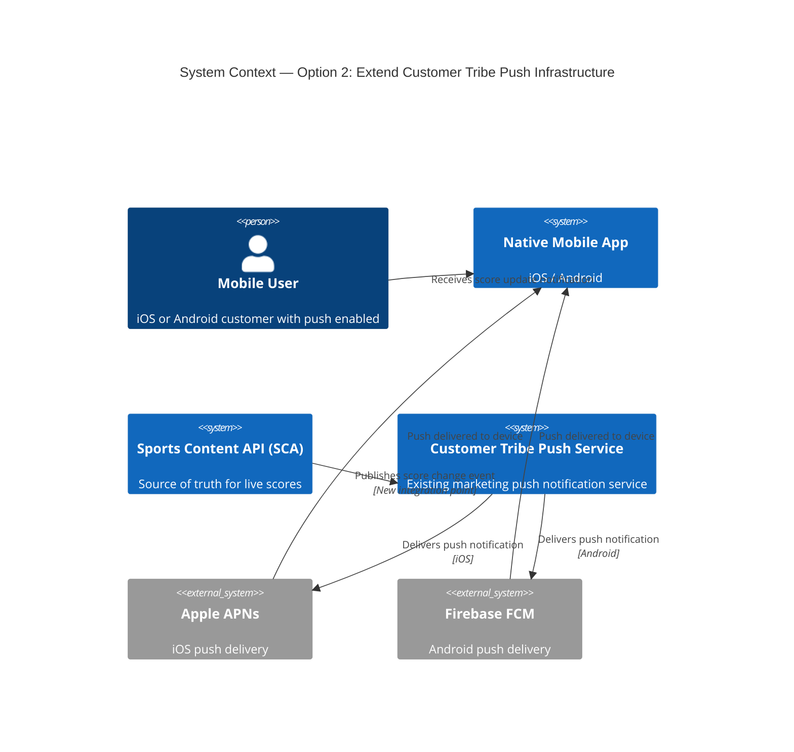
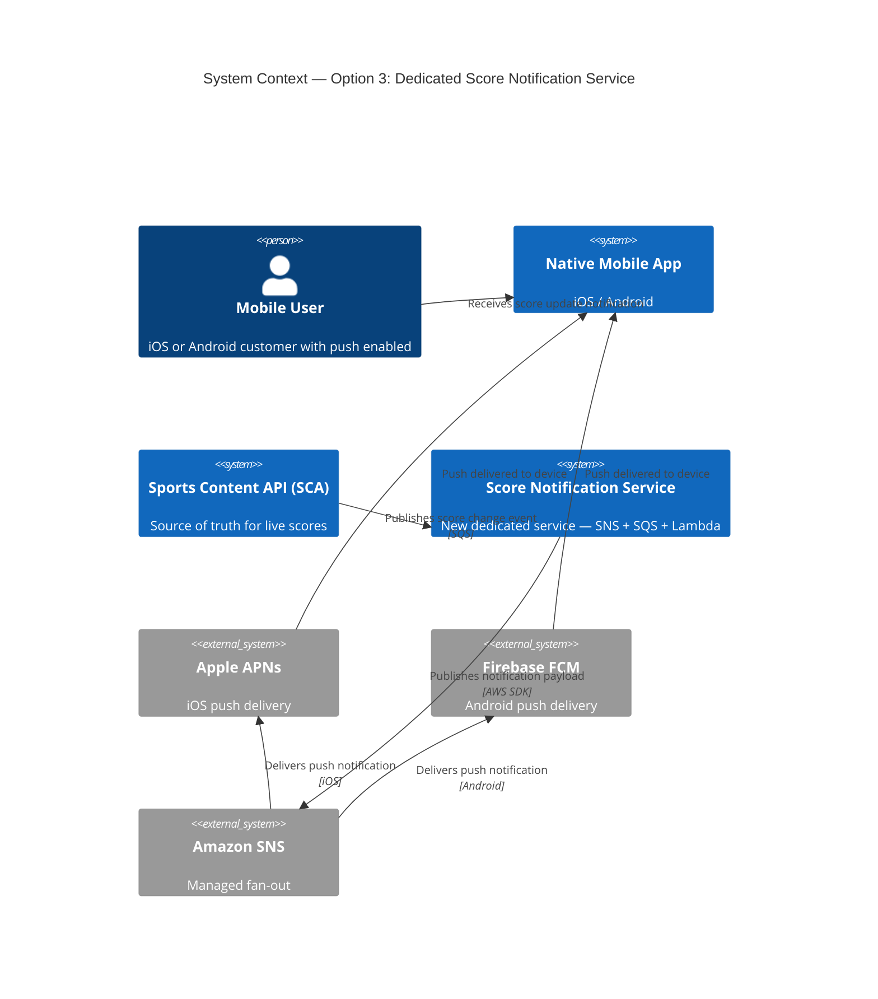

# ADR-029: Push Notifications for Native App Score Updates

## Table of Contents

- [Version Control](#document-version)
- [Document Overview](#metadata)
- [Context](#context)
- [Decision Drivers](#decision-drivers)
- [Decision](#decision)
- [Considered Options](#alternatives-considered)
- [Recommendation](#recommendation)
- [Consequences](#consequences)
- [Pros and Cons](#alternatives-considered)
- [Links](#related-decisions)

**Document Version:**

| Version | Date | Who | What |
|---------|------|-----|------|
| 0.1 | May 15, 2026 | | Draft |

---

## Metadata

| Field | Value |
|-------|-------|
| **Decision Required** | How should native app clients (iOS and Android) be notified of score changes, and is the investment in a dedicated push notification solution justified given low opt-in rates? |
| **Decision Outcome** | Pending |
| **Owner** | |
| **Domain** | Sports / Native Apps |
| **Current Status** | `Proposed` |
| **Deciders** | Mobile Team, Sports Platform Team, Customer Tribe, Architecture |

---

## Context

Native iOS and Android clients currently receive score updates via a polling mechanism that fires every 5 seconds. This approach works but has several drawbacks: it is inefficient, increases battery and data usage on mobile devices, and introduces up to 5 seconds of latency before a score change is visible to the user.

A push notification infrastructure already exists within the organisation. It is owned and operated by the **Customer Tribe** and is primarily designed for **marketing notifications** (e.g. promotional offers, re-engagement campaigns). It is not currently used for real-time in-play data such as score changes.

The core question is not purely technical. There is a well-founded concern that **push notification opt-in rates for native apps are low** — particularly for sports score alerts — meaning that even if a technically sound solution is delivered, the proportion of users who actually receive the notifications may not justify the investment required to build and operate it.

Any solution must:
- Support both **iOS** (APNs) and **Android** (FCM) platforms
- Be capable of scaling to support **multiple brands** without fundamental rework
- Be capable of handling **peak traffic** during high-volume sporting events (e.g. Saturday Premier League fixtures, major tournaments)
- Avoid duplicating infrastructure that already exists elsewhere in the organisation unless there is a clear justification to do so

This ADR considers three options, including the baseline of doing nothing.

---

## Decision Drivers

- **Opt-in rate risk** — push notifications require the user to grant permission. Industry opt-in rates for sports apps vary widely (typically 40–60%). If opt-in rates are low, the cost of building a bespoke solution will not be recovered in user engagement terms. This is the primary risk.
- **Cost** — any solution must be cost-effective at peak load, particularly during major sporting events where message volume will spike significantly.
- **Operational simplicity** — preference for managed infrastructure or reuse of existing capabilities to avoid creating a new operational support burden.
- **Scalability** — the solution must extend to additional brands without significant rework.
- **Time to value** — a faster, lower-effort delivery is preferable if opt-in rates are unproven.

---

## Decision

> **Pending.** See [Recommendation](#recommendation) below.

---

## Architecture Diagram (Chosen Option)

---

## Principles Alignment

| Principle | Alignment | Notes |
|-----------|-----------|-------|
| Cloud-First | ✅ | Amazon SNS is fully managed; APNs and FCM are vendor-managed |
| API-First | ✅ | Notification payloads defined as a schema; SCA integration via event contract |
| Security by Design | ✅ | APNs certificates and FCM keys stored in AWS Secrets Manager; no PII in notification payloads |
| Observability | ✅ | SNS delivery status logging to CloudWatch; dead-letter queues for failed deliveries |
| Resilience | ✅ | SNS provides automatic retries and DLQ support; multi-AZ by default |
| Cost Efficiency | ⚠️ | Cost is proportional to message volume and opt-in rate. If opt-in rates are low, cost per engaged user increases. Monitoring and alerting required. |
| Technology Standards | ✅ | Amazon SNS is an established AWS standard for mobile push; no new technology introduced |
| Data Management | ✅ | Device tokens managed securely; token lifecycle (registration, rotation, expiry) must be handled by the mobile team |

---

## Impacts

### Teams Impacted
- **Mobile Team (iOS and Android)** — push permission prompting, device token registration, notification handling in-app
- **Sports Platform Team** — SCA event integration, notification payload design
- **Customer Tribe** — alignment required on whether the existing marketing push infrastructure should be extended or a separate service built
- **Platform / DevOps Team** — SNS topics, SQS queues, IAM roles, Secrets Manager
- **Security Team** — APNs certificate and FCM key management

### Systems Impacted
- iOS Native App (upstream consumer — requires opt-in permission flow and token registration)
- Android Native App (upstream consumer — requires opt-in permission flow and token registration)
- Sports Content API (SCA) — upstream event source; integration point for score change events
- Amazon SNS — notification fan-out to APNs and FCM
- Amazon SQS — decoupling between SCA and the notification service
- AWS Secrets Manager — credential storage for APNs and FCM

### Timeline

| Phase | Description | Duration |
|-------|-------------|----------|
| Discovery | Align with Customer Tribe on shared vs. separate infrastructure. Confirm opt-in rate data if available. Define notification payload schema. | 1 week |
| Design | SNS topic design, SCA event integration, device token registration approach, brand configuration model | 1 week |
| Implementation | SNS setup, SCA integration, mobile token registration, notification handling | 3–4 weeks |
| Testing | End-to-end testing on iOS and Android, load testing at simulated peak, multi-brand validation | 1–2 weeks |
| Rollout | Staged rollout with monitoring. Track opt-in rates and engagement metrics. | 1 week |

### Risks

| Risk | Likelihood | Impact | Mitigation |
|------|------------|--------|------------|
| Low push notification opt-in rates make ROI unviable | High | High | Treat this as an explicit go/no-go gate. Run a discovery spike to gather opt-in rate data before committing to full build. Consider a lightweight experiment first (Option 2). |
| APNs / FCM credential expiry or misconfiguration causes silent delivery failure | Medium | High | Store credentials in Secrets Manager with rotation reminders. Monitor SNS delivery status logs. |
| Device token churn (uninstalls, re-installs) leads to stale tokens and failed deliveries | Medium | Medium | Implement token refresh and expiry handling in the mobile registration flow. |
| Message volume during peak events (e.g. simultaneous score changes across many fixtures) causes throttling | Medium | High | Test at peak-representative load. Use SQS to buffer SCA events before fan-out. SNS scales automatically but APNs and FCM have rate limits. |
| Duplication of effort with existing Customer Tribe push infrastructure | Medium | Medium | Align early with Customer Tribe before building. Shared infrastructure is preferred if it can be extended safely. |
| Multi-brand configuration complexity increases operational overhead | Low | Medium | Design the notification service with brand as a first-class configuration parameter from the outset. |

---

## Consequences

### Positive
- Native app users who have opted in receive near-real-time score change notifications without opening the app
- Polling overhead is reduced for opted-in users, improving battery and data efficiency on device
- A scalable, brand-configurable push notification capability is established for future use cases (e.g. match start reminders, price change alerts)
- Using Amazon SNS abstracts platform-specific differences between APNs and FCM behind a single integration point

### Negative
- Push notification opt-in is not guaranteed. A significant proportion of users may never receive these notifications, limiting the actual reach of the feature
- Device token lifecycle management (registration, refresh, expiry) adds complexity to the mobile client
- A new operational component is introduced. Monitoring, credential rotation, and delivery failure alerting must be owned by a team
- If the existing Customer Tribe push infrastructure is not reused, there is a risk of organisational duplication in infrastructure and operational knowledge

---

## Alternatives Considered

### Option 1 — Do Nothing (Baseline)

Retain the existing 5-second polling mechanism in the native app. No infrastructure change is made.

**Pros / Cons**
- ✅ Zero delivery risk. Polling is proven and all users receive score updates regardless of notification permissions.
- ✅ No build investment required. Engineering capacity is preserved for higher-ROI work.
- ✅ No new operational components to own or monitor.
- ❌ Score updates continue to have up to 5 seconds of latency.
- ❌ Polling increases battery drain and data usage on mobile devices compared to a push-based approach.
- ❌ The user experience gap between native apps and web remains unaddressed.

**C4 System Context Diagram**

---

### Option 2 — Extend the Existing Customer Tribe Push Infrastructure

The Customer Tribe already operates a push notification service used for marketing messages. Rather than building a new service, the Sports Platform Team works with the Customer Tribe to extend the existing infrastructure to support score change notifications as a new notification type.

This is a lower-effort, lower-risk option that leverages existing investment and avoids duplicating infrastructure.

**Pros / Cons**
- ✅ Reuses existing investment in push notification infrastructure (device token registration, APNs/FCM integration, opt-in flows).
- ✅ Lower build effort and faster time to value.
- ✅ Reduces organisational duplication of push notification capability.
- ✅ Opt-in rates from the existing marketing notification user base provide an early signal on likely reach before committing to further investment.
- ❌ The existing infrastructure is designed for low-frequency marketing messages, not high-volume, time-sensitive in-play events. It may not be able to handle peak message volumes during major fixtures without re-architecture.
- ❌ The Sports Platform Team takes a dependency on a service owned and prioritised by another tribe, introducing delivery risk.
- ❌ Marketing and in-play notification concerns become coupled in a single service, which may complicate future evolution of either.

**C4 System Context Diagram**

---

### Option 3 — Build a Dedicated Score Notification Service (Amazon SNS + SQS) ✅ RECOMMENDED IF PROCEEDING

Build a new, purpose-built notification service using Amazon SNS for platform delivery (APNs and FCM) and Amazon SQS to decouple the Sports Content API from the notification fan-out. The service is designed from the outset to be brand-configurable and to scale to peak event volumes.

This is the architecturally correct long-term solution but carries the highest build effort and is only justified if opt-in rate data supports the investment.

**Pros / Cons**
- ✅ Purpose-built for high-volume, time-sensitive in-play events. Can be load tested and scaled independently of the marketing push service.
- ✅ Brand-configurable from the outset. Extending to additional brands requires configuration changes, not re-architecture.
- ✅ Full ownership by the Sports Platform Team with no cross-tribe dependency.
- ✅ Amazon SNS scales automatically. SQS buffers peak event bursts from SCA without message loss.
- ❌ Highest build effort of the three options. Introduces a new operational component that must be owned, monitored, and maintained.
- ❌ Duplicates push notification infrastructure that already exists in the Customer Tribe, unless that capability is formally decommissioned or consolidated.
- ❌ Investment is only recoverable if opt-in rates are sufficient. If fewer than ~40% of active native app users opt in to score notifications, the cost-per-engaged-user may not justify the investment over continued polling.

**C4 System Context Diagram**

---

## Recommendation

**The primary risk with this initiative is not technical — it is whether enough users will opt in to push notifications to make the investment worthwhile.**

Before committing to either Option 2 or Option 3, a **discovery spike** is recommended to:

1. Establish current opt-in rates from the existing Customer Tribe push notification data
2. Identify whether score change notifications are a category users are willing to enable (user research or A/B test on the opt-in prompt)
3. Confirm whether the existing Customer Tribe infrastructure can support in-play message volumes

If the discovery spike confirms that opt-in rates are likely to be sufficient (indicative threshold: >40% of active native app users), the recommendation is to **proceed with Option 2 first** (extend existing Customer Tribe infrastructure) as a low-effort MVP to validate engagement before investing in a purpose-built service (Option 3).

If discovery confirms that opt-in rates will not support the investment, **Option 1 (do nothing)** is the appropriate outcome. Continued polling is a known, working baseline with no delivery risk.

---

## Related Decisions

| ADR | Title | Link |
|-----|-------|------|
| ADR-013 | PUSH Notifications for Gamestate Updates | [adr-013](./adr-013-push-notifications-for-gamestate-updates.md) |
| ADR-018 | Replace Polling with PUSH Solution | [adr-018](./adr-018-replace-polling-with-push-solution.md) |
| ADR-019 | Implementing AWS AppSync for Native Notifications | [adr-019](./adr-019-implementing-aws-appsync-for-native-notifications.md) |
| ADR-021 | Replace Polling with Push for Prices | [adr-021](./adr-021-replace-polling-with-push-for-prices.md) |
| ADR-028 | Push-Based Game State Updates to the Frontend | [adr-028](./adr-028-push-based-gamestate-updates.md) |

---

## References

- [Amazon SNS Mobile Push Notifications](https://docs.aws.amazon.com/sns/latest/dg/sns-mobile-application-as-subscriber.html)
- [Apple Push Notification service (APNs)](https://developer.apple.com/documentation/usernotifications)
- [Firebase Cloud Messaging (FCM)](https://firebase.google.com/docs/cloud-messaging)
- [AWS SNS + SQS Fan-out Pattern](https://docs.aws.amazon.com/sns/latest/dg/sns-sqs-as-subscriber.html)
