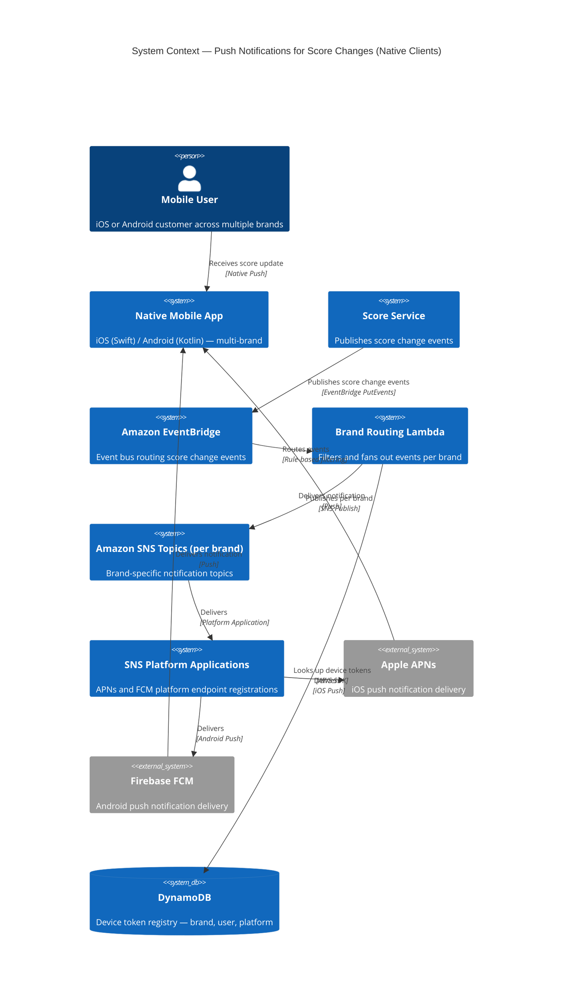
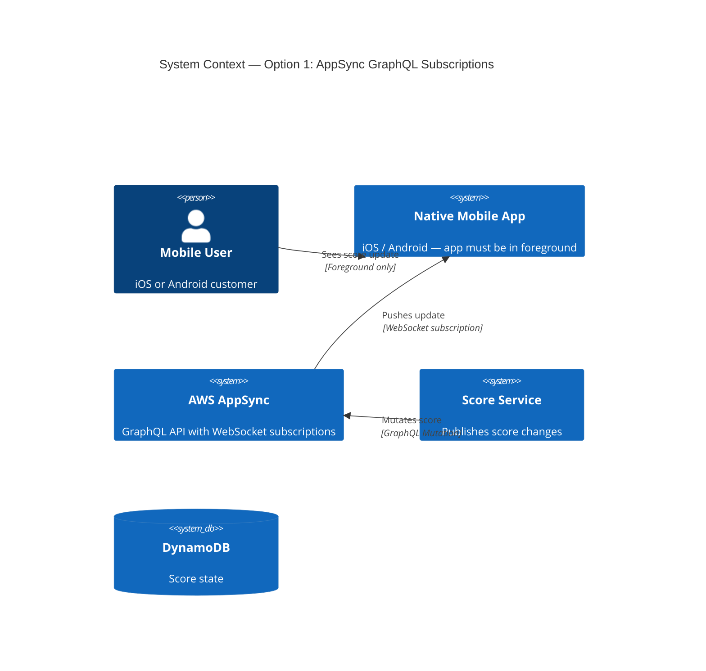
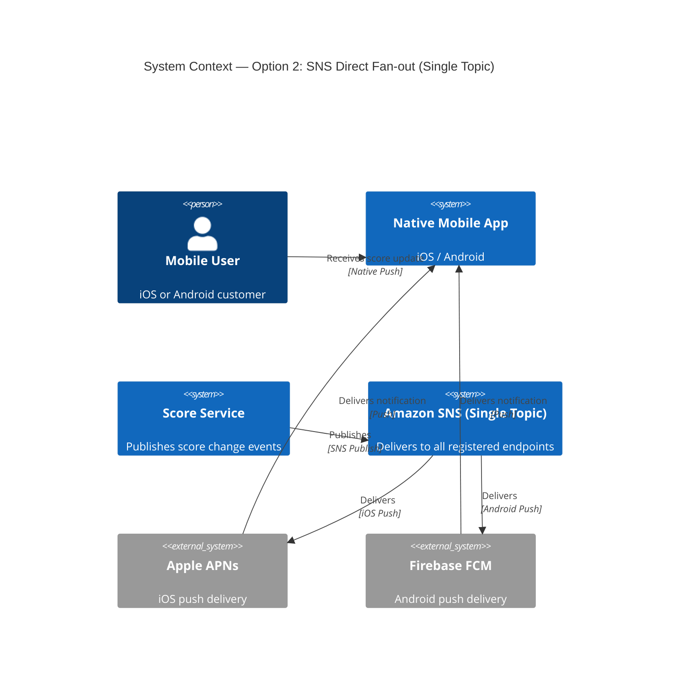
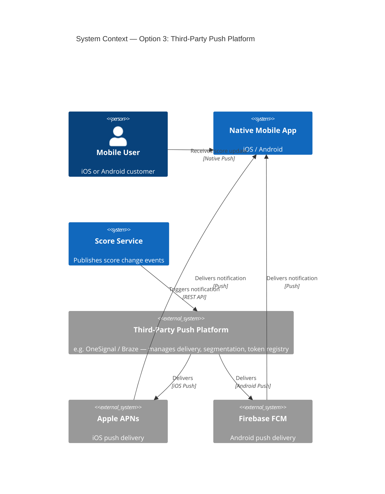

# ADR-029: Push Notifications for Score Changes on Native App Clients

## Metadata

| Field | Value |
|-------|-------|
| Status | Draft <!-- Draft | Proposed | Accepted | Deprecated | Superseded --> |
| Date | 2026-05-15 |
| Owner | Ewan Peters |
| Category | Integration <!-- Infrastructure | Data | Security | Integration | API | Other --> |
| Priority | High <!-- High | Medium | Low --> |

## Context

Native mobile clients (iOS and Android) currently have no mechanism to receive real-time score change notifications. Users must manually refresh or rely on polling-based approaches, which degrades the user experience during live sporting events.

There is a requirement to push score change notifications to native app clients across multiple brands. The solution must:

- Support both **iOS** (Apple Push Notification service — APNs) and **Android** (Firebase Cloud Messaging — FCM).
- Be **multi-brand capable**, allowing different brands to route and customise notifications independently.
- **Scale during peak events** (e.g., major tournaments, finals) where concurrent score changes may be very high volume.
- Be evaluated against the concern that the implementation effort may outweigh the return on investment, particularly if engagement uplift is uncertain.

## Decision

Adopt **AWS Simple Notification Service (SNS)** with **platform application endpoints** (APNs and FCM) as the push delivery layer, fronted by an **event-driven pipeline** using **Amazon EventBridge** and **AWS Lambda** to process score change events. A **brand-aware routing layer** will be implemented in Lambda to fan-out notifications to the correct SNS topic per brand.

This approach was selected over AWS AppSync subscriptions (see ADR-019) because:
- APNs/FCM push notifications work even when the app is **backgrounded or closed** — AppSync GraphQL subscriptions require an active WebSocket connection.
- SNS natively integrates with both APNs and FCM without additional SDKs on the backend.
- The architecture is decoupled, allowing brand topics to be added without changes to the core pipeline.

## Architecture Diagram (Chosen Option)

## Principles Alignment

| Principle | Alignment | Notes |
|-----------|-----------|-------|
| Cloud-First | ✅ | Fully managed: SNS, EventBridge, Lambda, DynamoDB |
| API-First | ✅ | Score service publishes events via a well-defined EventBridge schema |
| Security by Design | ✅ | IAM roles, device token encryption at rest, no PII in notification payloads |
| Observability | ✅ | CloudWatch metrics, SNS delivery logs, X-Ray tracing on Lambda |
| Resilience | ✅ | EventBridge retry policies, SQS dead-letter queue for failed deliveries, multi-AZ |
| Cost Efficiency | ⚠️ | SNS/Lambda is pay-per-use and cost-effective at low volume; high event throughput during peak events warrants capacity modelling |
| Technology Standards | ✅ | AWS-native stack consistent with existing decisions (ADR-014, ADR-019) |
| Data Management | ✅ | Device tokens stored securely in DynamoDB; tokens invalidated on app uninstall via SNS feedback |

## Impacts

### Teams Impacted
- **Mobile Team (iOS & Android)** — device token registration, notification handling, deep-link routing per brand
- **Backend / Integrations Team** — Lambda routing logic, EventBridge rules, SNS configuration
- **Platform / DevOps Team** — AWS infrastructure provisioning (Terraform/CDK), CI/CD pipelines
- **Product / Brand Teams** — notification content, opt-in/opt-out UX, brand-specific customisation
- **Security Team** — APNs certificates / FCM service account management, IAM policy review

### Systems Impacted
- Score Service (upstream event producer)
- Native Mobile Apps — iOS and Android (downstream consumers)
- DynamoDB device token registry (new or extended)
- Amazon SNS / EventBridge / Lambda (new infrastructure)
- Existing push notification pipelines (ADR-019) — may be consolidated

### Timeline
| Phase | Description | Duration |
|-------|-------------|----------|
| Phase 1 — Foundation | EventBridge schema, DynamoDB token registry, single-brand SNS topic, Lambda routing skeleton | 2 weeks |
| Phase 2 — Platform Integration | APNs and FCM SNS platform applications, iOS & Android SDK integration, device token registration API | 3 weeks |
| Phase 3 — Multi-brand & Scaling | Brand fan-out routing, per-brand topics, load testing at peak event volumes, observability dashboards | 2 weeks |
| Phase 4 — Hardening | Dead-letter queues, token invalidation feedback loop, opt-out compliance, runbook | 1 week |

### Risks
| Risk | Likelihood | Impact | Mitigation |
|------|------------|--------|------------|
| Effort outweighs returns (low engagement uplift) | Medium | High | Define measurable success metrics (CTR, session start rate post-notification) before committing to Phase 3; review after Phase 2 pilot |
| Peak event throughput exceeds SNS/Lambda concurrency limits | Medium | High | Pre-warm Lambda, set reserved concurrency, use SQS as EventBridge target to absorb bursts before Lambda fan-out |
| APNs certificate or FCM service account expiry causing silent failures | Medium | High | Automate certificate rotation, monitor SNS delivery failure alarms |
| Device token staleness (uninstalls, OS upgrades) | High | Low | Process SNS delivery failure feedback to prune invalid tokens from DynamoDB |
| Multi-brand scope creep increasing delivery complexity | Low | Medium | Define brand configuration schema upfront; brands are additive via new SNS topics and Lambda config, no code changes |
| Regulatory / opt-in compliance across jurisdictions | Medium | High | Implement notification opt-in at registration; honour opt-out immediately; audit log all preference changes |

## Consequences

### Positive
- Users receive **real-time score updates** even when the app is backgrounded or closed, significantly improving live event engagement.
- The **event-driven, decoupled architecture** allows new brands to be onboarded by adding SNS topics and Lambda routing rules — no core code changes.
- **SNS + Lambda is serverless and scales automatically**, handling spikes during major tournaments without manual intervention.
- Consistent with the existing AWS-native push strategy established in ADR-014 and ADR-019.
- Provides a reusable notification platform that can be extended beyond score changes (e.g., bet settlement, promotional alerts).

### Negative
- **Implementation effort is non-trivial** — mobile SDK changes, APNs/FCM certificate management, device token lifecycle, and multi-brand routing all require coordinated delivery across multiple teams.
- **ROI is uncertain** until engagement data is available; a phased delivery approach with success criteria at Phase 2 mitigates the risk of over-investing.
- SNS does not guarantee notification **delivery ordering** for rapid successive score changes; payload design must be idempotent (include score snapshot, not delta).
- Adds **operational complexity**: certificate rotation, token hygiene, dead-letter queue monitoring, and opt-out compliance are ongoing responsibilities.

## Alternatives Considered

### Option 1: AWS AppSync GraphQL Subscriptions (extend ADR-019)

Extend the existing AppSync implementation (ADR-019) to push score change events to native clients via GraphQL subscriptions over WebSocket.

**Pros / Cons**
- ✅ Consistent with current AppSync investment; shared infrastructure
- ✅ Real-time, low-latency delivery while the app is in the foreground
- ❌ Requires an **active WebSocket connection** — notifications are not delivered when the app is backgrounded or closed
- ❌ Does not leverage native OS notification tray; users must open the app to see updates

**C4 System Context Diagram**

### Option 2: Amazon SNS Direct Fan-out (no EventBridge, no brand routing layer)

Publish directly from the Score Service to a single SNS topic; SNS delivers to all registered device endpoints regardless of brand.

**Pros / Cons**
- ✅ Simpler initial implementation — fewer components
- ✅ Lower latency (removes EventBridge hop)
- ❌ **No brand isolation** — all brands share one topic; cannot customise content or targeting per brand
- ❌ Tight coupling between Score Service and SNS; harder to add filtering logic later
- ❌ Does not meet the multi-brand scalability requirement

**C4 System Context Diagram**

### Option 3: Third-party Push Platform (e.g., OneSignal, Braze)

Use a managed third-party notification platform to handle device registration, segmentation, and delivery across iOS and Android.

**Pros / Cons**
- ✅ Significantly reduces backend implementation effort; platform handles token management, retries, and delivery analytics
- ✅ Built-in multi-brand / multi-app support, A/B testing, and rich notification templating
- ❌ **Vendor dependency and data residency concerns** — device tokens and user targeting data leave AWS boundary
- ❌ Ongoing SaaS licensing costs that scale with message volume
- ❌ Less control over delivery behaviour during peak events; subject to third-party SLA

**C4 System Context Diagram**

## Related Decisions

| ADR | Title | Link |
|-----|-------|------|
| ADR-013 | PUSH Notifications for Gamestate Updates | [adr-013](./adr-013-push-notifications-for-gamestate-updates.md) |
| ADR-014 | Changing PUSH to use AWS AppSync | [adr-014](./adr-014-changing-push-to-use-aws-appsync.md) |
| ADR-019 | Implementing AWS AppSync for Native Notifications | [adr-019](./adr-019-implementing-aws-appsync-for-native-notifications.md) |
| ADR-021 | Replace Polling with Push for Prices | [adr-021](./adr-021-replace-polling-with-push-for-prices.md) |
| ADR-028 | Push-Based Gamestate Updates | [adr-028](./adr-028-push-based-gamestate-updates.md) |

## Related Repositories

| Repository | Purpose | Key Files/Folders |
|------------|---------|-------------------|
| TBD — Score Service | Upstream event producer; must publish score change events to EventBridge | `/src/events/` |
| TBD — Mobile iOS | Device token registration, notification handling, deep-link routing | `/NotificationService/` |
| TBD — Mobile Android | FCM integration, notification handling | `/app/src/main/java/.../push/` |

## References

- [AWS SNS Mobile Push Notifications](https://docs.aws.amazon.com/sns/latest/dg/sns-mobile-application-as-subscriber.html)
- [Apple Push Notification service (APNs)](https://developer.apple.com/documentation/usernotifications)
- [Firebase Cloud Messaging (FCM)](https://firebase.google.com/docs/cloud-messaging)
- [Amazon EventBridge — Event-driven architectures](https://docs.aws.amazon.com/eventbridge/latest/userguide/eb-what-is.html)
- ADR-019 — Implementing AWS AppSync for Native Notifications
