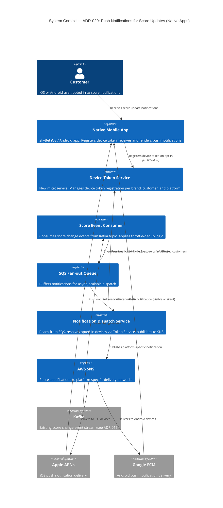
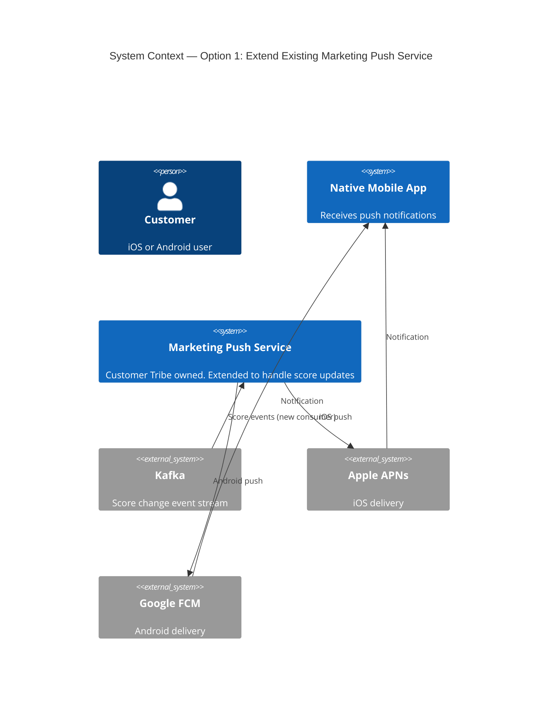
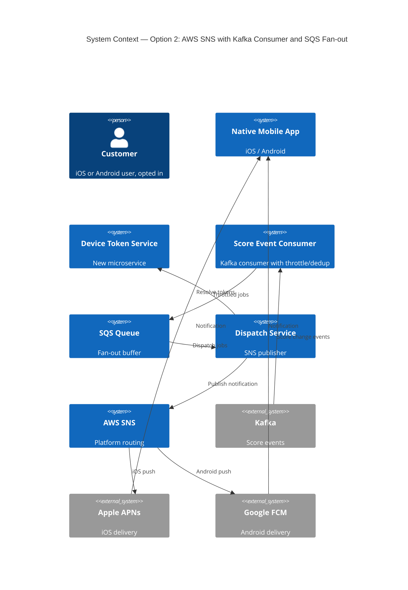
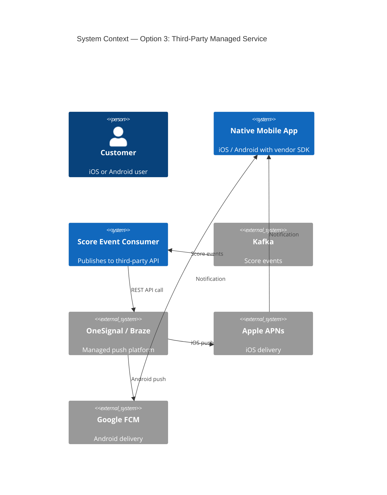

# ADR-029: Push Notifications for Score Updates on Native Apps

## Metadata

| Field | Value |
|-------|-------|
| Status | Draft |
| Date | 2026-05-15 |
| Owner | Ewan Peters |
| Category | Integration |
| Priority | High |

## Context

Native iOS and Android clients currently have no push notification capability for score updates. Customers who want live score changes must either manually refresh the app or wait for the polling cycle, which runs every 5 seconds. This creates a poor real-time experience and places unnecessary load on backend services during peak events (e.g. a full Premier League Saturday card).

An existing push notification service is in place but is owned and operated by the Customer Tribe and is used exclusively for marketing notifications. Coupling a transactional, real-time score update service to that platform is undesirable as it would introduce cross-tribe dependencies and could compromise the reliability and independence of both capabilities.

Score change events are available on a Kafka topic (see [ADR-015](adr-015-changing-kafka-to-sqs.md)). The solution must serve multiple brands — each with their own iOS and Android apps — starting with SkyBet, while sharing common backend infrastructure. It must also handle significant, unpredictable traffic spikes during peak sporting events.

There is a recognised concern that the backend effort required to build this service may be substantial, and that the value realised could be limited if customer opt-in rates are low. This ADR captures that risk explicitly alongside the options analysis.

### Background: Estimated Score Event Volume

As an indicative scale reference, a typical Premier League Saturday (10 fixtures) produces approximately:
- ~30 goals across all matches (~3 per game average)
- Each goal generates score update events plus associated market/odds change events
- For a platform with hundreds of thousands of active users, a single goal event could fan out to **tens of thousands of simultaneous push notifications**
- During peak windows (3pm–5pm Saturday) multiple events can occur within seconds of each other across concurrent fixtures

This informs both the throttling strategy and the infrastructure scaling requirements.

## Decision

Build a **new, independently owned push notification service** for transactional score updates, separate from the existing marketing push capability. The service will consume score change events from the existing Kafka topic, fan out notifications to registered devices via **AWS SNS** (routing to Apple APNs for iOS and Google FCM for Android), and be architected as a multi-brand platform from the outset.

The chosen approach is **Option 2: AWS SNS with Kafka Consumer and SQS Fan-out** (see Alternatives Considered below).

Key design decisions within this option:

- **Device token registration** will be handled per brand, with a lightweight microservice storing device tokens tagged by brand, customer ID, and platform (iOS/Android)
- **Customer opt-in** is required at the device level; the service will only dispatch notifications to opted-in devices, respecting per-brand preferences
- **Notification type** will support both visible (tray notification) and silent (background data) push, configurable per customer preference
- **Throttling and deduplication** will be applied to prevent notification fatigue during high-frequency scoring events — a configurable minimum interval per subscription type will be enforced (e.g. no more than one score notification per 10 seconds per customer per match)
- **Catch-up mechanism**: if a notification is missed (device offline, APNs/FCM drop), the app will fetch the current score on next foreground entry via the existing polling/REST mechanism — full guaranteed delivery is explicitly out of scope for MVP
- **Scaling** will be achieved via SQS as a buffer between the Kafka consumer and the SNS dispatch layer, allowing the fan-out to scale horizontally without back-pressure on the event stream

## Architecture Diagram (Chosen Option)

## Principles Alignment

| Principle | Alignment | Notes |
|-----------|-----------|-------|
| Cloud-First | ✅ | AWS SNS, SQS — fully managed, no infrastructure to maintain |
| API-First | ✅ | Device token registration exposed as a REST API, consumable by any brand's mobile app |
| Security by Design | ✅ | Device tokens stored securely; no PII in notification payloads; opt-in enforced at service level |
| Observability | ✅ | CloudWatch metrics on SQS depth, SNS delivery rates, and APNs/FCM failure rates; alerts on delivery failures |
| Resilience | ✅ | SQS decouples consumer from dispatch; SNS has built-in retry; missed notifications handled by app-side catch-up |
| Cost Efficiency | ⚠️ | Pay-per-notification SNS pricing is cost-effective at moderate scale, but fan-out cost at very high peak volume (millions of notifications) must be monitored. Throttling helps bound cost. |
| Technology Standards | ✅ | Kafka, SQS, SNS all consistent with existing platform choices |
| Data Management | ✅ | Device tokens scoped per brand and customer; opt-out removes tokens; no score data persisted in notification layer |

## Impacts

### Teams Impacted

- **Mobile Team** (iOS & Android) — device token registration, opt-in UX, handling both visible and silent push payloads
- **Backend / Platform Team** — building the Device Token Service, Score Event Consumer, and Dispatch Service
- **SkyBet Brand Team** — first consumer of the new capability
- **DevOps / Platform Engineering** — SQS, SNS, and IAM configuration; CloudWatch alerting

### Systems Impacted

- **Native Mobile Apps** (iOS & Android) — new registration flow; push notification handling
- **Kafka Score Event Topic** — new consumer added; no changes to producer
- **Existing Marketing Push Service** — not impacted; explicitly decoupled
- **AWS Account** — new SNS topics, SQS queues, and supporting Lambda/microservice infrastructure

### Timeline

| Phase | Description | Duration |
|-------|-------------|----------|
| Discovery & Design | Finalise device token service API contract; confirm Kafka topic schema; agree throttle thresholds; iOS/Android SDK selection | 2 weeks |
| Backend MVP | Device Token Service, Kafka consumer, SQS fan-out, SNS dispatch for SkyBet | 4–6 weeks |
| Mobile Integration | iOS and Android opt-in UX, token registration, visible and silent push handling | 3–4 weeks (parallel with backend) |
| Load Testing & Tuning | Simulate peak event fan-out; validate throttling; tune SQS concurrency and SNS throughput limits | 2 weeks |
| SkyBet Production Launch | Phased rollout with feature flag; monitor opt-in rates and delivery metrics | 1–2 weeks |
| Multi-Brand Onboarding | Parameterise for additional brands; onboarding runbook | TBD per brand |

### Risks

| Risk | Likelihood | Impact | Mitigation |
|------|------------|--------|------------|
| Low customer opt-in rate undermines ROI | Medium | High | Run opt-in campaign alongside launch; instrument opt-in funnel; set measurable success criteria before committing to multi-brand rollout |
| Peak fan-out volume exceeds SNS/SQS throughput limits | Medium | High | Load test at 2x expected peak; configure SQS concurrency limits and SNS sandbox testing; use SQS as buffer to smooth bursts |
| APNs/FCM credential management complexity across brands | Medium | Medium | Centralise credential storage in AWS Secrets Manager; one SNS platform application per brand per platform |
| Notification fatigue causes customers to disable push entirely | Medium | Medium | Enforce throttle at consumer level; provide granular opt-in (e.g. per sport or per match) in future iterations |
| Missed notifications not recovered (device offline) | Low | Low | App-side catch-up on foreground entry is sufficient for MVP; full guaranteed delivery explicitly deferred |
| Backend build effort exceeds estimates | Medium | High | Timebox MVP to SkyBet only; validate value (opt-in rate, engagement uplift) before investing in multi-brand generalisation |

## Consequences

### Positive

- Customers receive score updates in near real-time (sub-5 seconds) without needing to refresh the app, directly improving the in-play and live score experience
- Reduced polling load on backend services — fewer unnecessary 5-second refresh cycles from active users
- New capability is brand-agnostic by design, enabling future brands to onboard without re-platforming
- Clean tribal separation — no dependency on the Customer Tribe's marketing push service
- SQS buffering provides natural protection against event storms during peak sporting fixtures

### Negative

- Substantial upfront backend investment is required before any customer value is delivered
- Value is gated on customer opt-in; if opt-in rates are low, the ROI case is weak
- APNs and FCM credentials must be managed per brand, increasing operational overhead as brands are onboarded
- Throttling logic adds complexity and requires careful tuning to balance timeliness vs. notification fatigue
- The catch-up mechanism (polling on app foreground) means the solution does not fully replace the existing polling for correctness — polling must remain in place as a fallback

## Alternatives Considered

### Option 1: Extend the Existing Marketing Push Service

Reuse the marketing notification infrastructure (owned by the Customer Tribe) and extend it to dispatch score update notifications.

**Pros / Cons**
- ✅ Faster time to first delivery — infrastructure already exists
- ✅ Device tokens may already be registered for marketing purposes
- ❌ Introduces a hard cross-tribe dependency on the Customer Tribe for a real-time transactional capability
- ❌ Marketing push services are typically optimised for low-volume, scheduled sends — not high-frequency, low-latency fan-out
- ❌ Any outage or change in the marketing service could impact score notifications and vice versa
- ❌ Multi-brand parameterisation may not be supported in the existing service

---

### Option 2: New AWS SNS Service with Kafka Consumer and SQS Fan-out ✅ CHOSEN

A purpose-built, independently owned notification service consuming Kafka score events, buffering via SQS, and dispatching via AWS SNS to APNs/FCM.

**Pros / Cons**
- ✅ Full tribal independence — owned entirely by the platform team
- ✅ SQS buffer provides resilience and natural rate-limiting at peak
- ✅ SNS natively supports APNs and FCM with per-platform application configuration
- ✅ Scales horizontally without changes to the Kafka producer
- ✅ Multi-brand support via SNS platform application per brand
- ✅ Pay-per-use cost model — no cost during off-peak periods
- ❌ Net-new backend build — higher upfront effort than Option 1
- ❌ SNS fan-out cost at very high volume (millions of devices) requires monitoring

---

### Option 3: Third-Party Managed Service (e.g. OneSignal / Braze)

Use a managed third-party push platform that abstracts APNs/FCM complexity and provides a dashboard for managing notifications.

**Pros / Cons**
- ✅ Fast integration — SDKs available for iOS and Android
- ✅ Built-in segmentation, A/B testing, and analytics dashboards
- ✅ APNs/FCM credential management handled by the vendor
- ❌ Ongoing per-notification or per-MAU licensing cost — potentially significant at scale
- ❌ Vendor dependency introduces a risk to data sovereignty and introduces a third party into the notification pipeline
- ❌ Less control over throttling logic and delivery guarantees
- ❌ May not support the self-service multi-brand model required

## Related Decisions

- [ADR-014: Changing Push to use AWS AppSync](adr-014-changing-push-to-use-aws-appsync.md)
- [ADR-015: Changing Kafka to SQS](adr-015-changing-kafka-to-sqs.md)
- [ADR-019: Implementing AWS AppSync for Native Notifications](adr-019-implementing-aws-appsync-for-native-notifications.md)
- [ADR-028: Push-Based Gamestate Updates](adr-028-push-based-gamestate-updates.md)
