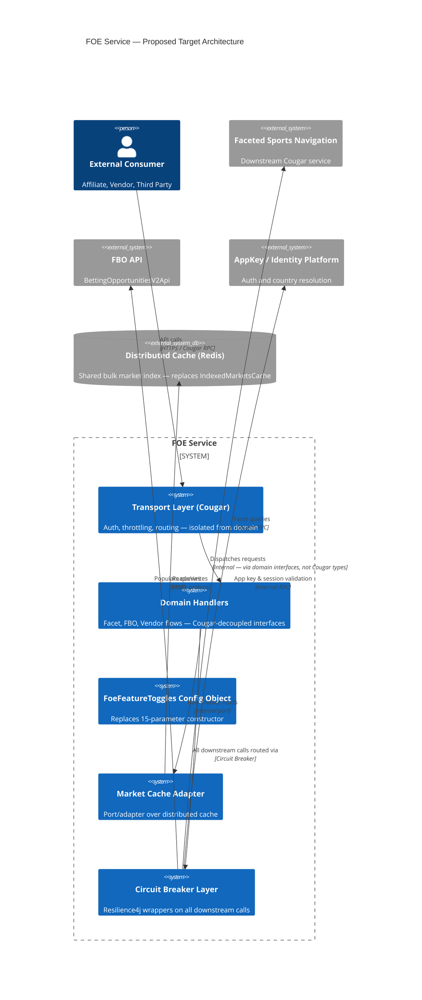

# ARCH-VALIDATION-0001: Fixed Odds External API (FOE) — Architecture Validation

**Date:** 27 May 2026
**Author:** GitHub Copilot (Architecture Validation Agent)
**Service:** foe-service
**Status:** Draft

---

## Table of Contents

- [Context and Assumptions](#context-and-assumptions)
- [Architectural Overview](#architectural-overview)
- [Principles Alignment](#principles-alignment)
- [Interaction and Integration Patterns](#interaction-and-integration-patterns)
- [Code and Service Design Quality](#code-and-service-design-quality)
- [Risks and Anti-Patterns](#risks-and-anti-patterns)
- [Scalability and Resilience Assessment](#scalability-and-resilience-assessment)
- [Security and Compliance Considerations](#security-and-compliance-considerations)
- [Recommendations](#recommendations)
- [Proposed Target Architecture](#proposed-target-architecture)

---

## Context and Assumptions

### What the System Does

FOE (Fixed Odds External API) is a Java/Spring service built on Betfair's internal Cougar RPC framework. It acts as a gateway exposing fixed-odds betting data and operations to external consumers (affiliates, vendors, and third-party integrators). Core capabilities include: listing market catalogues, event types, competitions, market prices, placing bets, bulk market data retrieval, and a newer "Flexible Betting Opportunities" (FBO/Populars) feature.

### Assumptions

The following assumptions were made due to incomplete context:

- Deployment target is assumed to be on-premise or Betfair internal infrastructure — Cougar is a Betfair-internal framework and no cloud infrastructure manifests were present.
- Downstream dependency topology is inferred from client module names (`faceted-sports-navigation`, `fbo-api`, `appkey`, `sso/session`).
- No architecture diagrams were provided; the overview below is inferred from source code structure.
- No SLA, SLO, or NFR documentation was available — scalability and resilience observations are inferred from code patterns only.

---

## Architectural Overview

### Architecture Style

**Monolith.** A single deployable unit (`application` module) handles all operations. This is not a microservices architecture, though it consumes multiple downstream services via Cougar RPC client modules.

### Key Components

| Component | Responsibility |
|---|---|
| `FixedOddsExternalApiAsyncServiceImpl` | Top-level service entry point; routes all API calls to handlers |
| `BaseHandler` | Cross-cutting concerns: auth, app key access control, throttling, downstream identity resolution |
| `FacetHandler` / per-operation handlers | Faceted navigation requests (list events, competitions, countries, venues, etc.) |
| `VendorWebDelegate` | Vendor OAuth/token flows for vendor integrations |
| `FlexibleBettingOpportunitiesServiceImpl` | Newer FBO/Populars feature; separate enrichment pipeline from facet handlers |
| `IndexedMarketsCache` | In-memory indexed market cache for bulk operations |
| `VendorCountryResolver` | Resolves caller jurisdiction/country from app key |
| `FOEFeatures` | Centralised feature toggle registry |

### Data Stores

- **In-memory cache only** (`IndexedMarketsCache`) — no direct database ownership. All data is sourced from downstream Cougar services. FOE is a read-aggregation service, not a data owner.

### Integration Points

| Dependency | Protocol | Purpose |
|---|---|---|
| Faceted Sports Navigation API | Cougar RPC (sync) | Market/event catalogue queries |
| FBO API (`BettingOpportunitiesV2Api`) | HTTP (sync) | Populars/FBO enrichment |
| AppKey / Identity Platform | Cougar RPC (sync) | App key access control and country resolution |
| SSO / Session Platform | Cougar RPC (sync) | Session token validation |

---

## Principles Alignment

| Principle | Alignment | Notes |
|---|---|---|
| Cloud-First | ⚠️ Partial | Cougar is a Betfair-internal framework with limited cloud portability |
| API-First | ✅ Aligned | Service is API-first by design; Cougar generates service interfaces |
| Security by Design | ✅ Aligned | Auth/authz enforced in `BaseHandler`; app key access control and session validation are present |
| Observability | ⚠️ Partial | Cougar provides basic logging; no structured tracing or distributed trace context visible |
| Resilience | ⚠️ Partial | Request throttling present; no circuit breakers or retry strategies on downstream calls |
| Cost Efficiency | ⚠️ Partial | In-memory bulk cache is efficient at single-instance level; no auto-scaling or serverless patterns |
| Technology Standards | ⚠️ Partial | Cougar diverges from industry-standard REST/gRPC patterns; limits tooling choices |
| Data Management | ✅ Aligned | No direct DB ownership; clear read-only boundary — FOE reads, does not own data |

---

## Interaction and Integration Patterns

### Synchronous-Only Integration

All downstream calls (Faceted Navigation, FBO API, AppKey, Session) are synchronous Cougar RPC calls. The `Async` in `FixedOddsExternalApiAsyncServiceImpl` refers to Cougar's `ExecutionObserver` callback pattern, not truly non-blocking I/O.

### Identified Concerns

| Concern | Detail |
|---|---|
| Tight Cougar coupling | `ExecutionObserver`, `RequestContext`, and `CougarException` permeate the entire codebase. Migration off Cougar would require broad, cross-cutting refactoring. |
| No event-driven patterns | All integrations are request/response. For high-frequency market data scenarios, this increases latency and amplifies downstream load. |
| Chatty facet calls | Each list operation (event types, countries, venues, competitions) is a separate downstream RPC call. There is no aggregation or batching layer. |
| Handler-per-operation pattern | ✅ Clean and consistent for facet operations — a positive structural pattern. |

---

## Code and Service Design Quality

### Strengths

- ✅ Clear handler hierarchy: `BaseHandler` → `FacetHandler` → concrete handlers. Separation of auth/throttle concerns from business logic is well-structured.
- ✅ `FboParamsValidator` implements a clean `Validator<T>` interface — composable and independently testable.
- ✅ Feature toggles are centralised in the `FOEFeatures` enum and constructor-injected, making them mockable in tests.
- ✅ Test coverage is broad: unit tests, integration tests (`integration-test-suite`), and sanity tests (`sanity-test-suite`) all present.

### Weaknesses

| Weakness | Detail |
|---|---|
| Constructor bloat | `FixedOddsExternalApiAsyncServiceImpl` accepts 15 `FeatureToggle` parameters — brittle to extend and difficult to read. |
| God class risk | `VendorWebDelegate` accumulates all vendor flow logic without a clear internal boundary. |
| Deprecated operations in production code | `getAccountFunds`, `token`, and `getAuthorisationCode` are annotated `@Deprecated` but remain active in the main service implementation. Technical debt is accumulating. |
| Mixed architectural styles | The FBO/Populars feature (`FlexibleBettingOpportunitiesServiceImpl`, `ListPopularsHandler`) uses a structurally different pattern from the facet handlers. Two design approaches coexist without documented rationale, increasing cognitive load for new contributors. |

---

## Risks and Anti-Patterns

| Risk | Severity | Detail |
|---|---|---|
| No circuit breaker on downstream calls | 🔴 High | If Faceted Navigation or FBO API degrades, FOE has no fallback mechanism — cascading failure risk for all consumers |
| Cougar framework lock-in | 🔴 High | Deep coupling to Cougar limits cloud portability, observability tooling choices, and future technology options |
| Constructor parameter explosion | 🟠 Medium | 15-parameter constructor on `FixedOddsExternalApiAsyncServiceImpl` is brittle to extend and a code smell |
| Growing God class | 🟠 Medium | `VendorWebDelegate` risks accumulating vendor flow logic without a clear internal boundary |
| Deprecated operations not removed | 🟠 Medium | Dead code risk; unclear handoff status of AAN-PP migration — operations may be called unexpectedly |
| Per-instance in-memory cache | 🟠 Medium | `IndexedMarketsCache` is per-JVM instance; bulk data consistency across horizontal replicas is unclear; memory footprint scales linearly |
| Mixed architectural styles | 🟢 Low | FBO handler pattern diverges from the facet handler pattern without documented intent |

---

## Scalability and Resilience Assessment

### Scalability

- **Horizontal scaling** is possible within the Cougar/JVM model, but the in-memory `IndexedMarketsCache` means each instance holds its own copy of bulk market data — memory pressure scales linearly with instance count.
- **Synchronous fan-out** to multiple downstream services per request compounds latency under load and increases downstream pressure.

### Resilience

- ✅ Request throttling is present via `RequestThrottle` in `BaseHandler`.
- ✅ FBO enrichment in `ListPopularsHandler` handles partial enrichment failures gracefully — null parts are filtered rather than causing full request failure.
- ❌ No circuit breaker pattern implemented on any downstream call.
- ❌ No retry with exponential backoff visible.
- ❌ No bulkhead isolation between facet, FBO, and vendor call paths.

---

## Security and Compliance Considerations

| Area | Status | Detail |
|---|---|---|
| App key access control | ✅ | `BaseHandler.validateAppKeyAccess()` returns `ACCESS_DENIED` for unconfigured or unauthorised keys |
| Session token validation | ✅ | Invalid sessions return `INVALID_SESSION_INFORMATION` — well-defined error contract |
| Jurisdiction resolution | ✅ | Resolved via `X-Jurisdiction` header with a default fallback |
| Silent fallback in `VendorCountryResolver` | ⚠️ | Exceptions are caught and a default country is returned silently — misconfigured app keys could resolve to an incorrect jurisdiction with no observable signal |
| External rate limiting | ⚠️ | No API gateway-level rate limiting visible — internal throttle only; potential for abuse by high-volume external consumers |
| Audit logging of security decisions | ⚠️ | No structured audit log of auth failures or access denials visible beyond standard log output |

---

## Recommendations

### 🔴 High Impact — Must Address

1. **Introduce circuit breakers on all downstream calls.**
   Wrap calls to Faceted Navigation, FBO API, and AppKey service with a circuit breaker (e.g. Resilience4j). Without this, a single downstream degradation causes a full FOE outage. Define fallback responses per operation where feasible.

2. **Decouple domain logic from the Cougar transport layer.**
   Introduce an internal port/adapter boundary separating FOE business logic from Cougar-specific types (`ExecutionObserver`, `RequestContext`, `CougarException`). This is a prerequisite for any future cloud migration and immediately improves testability.

### 🟠 Medium Impact — Should Address

3. **Refactor `FixedOddsExternalApiAsyncServiceImpl` constructor.**
   Group the 15 `FeatureToggle` parameters into a dedicated `FoeFeatureToggles` configuration object. This reduces coupling, improves readability, and simplifies future toggle changes.

4. **Remove or formally migrate deprecated operations.**
   `getAccountFunds`, `token`, and `getAuthorisationCode` should be removed once AAN-PP migration is confirmed live. Agree a removal date and track it as a formal work item to prevent indefinite drift.

5. **Externalise the bulk market cache.**
   Replace `IndexedMarketsCache` with a shared distributed cache (Redis) to ensure data consistency across horizontal replicas and reduce per-instance memory footprint. This aligns with ADR-004 (Redis for session caching) and extends that pattern.

6. **Align the FBO feature with the existing handler pattern — or document the divergence.**
   `ListPopularsHandler` should either extend `BaseHandler` consistently with the facet handlers, or the divergence should be documented as an intentional architectural decision (raise an ADR).

### 🟢 Low Impact — Consider

7. **Add distributed tracing.**
   Inject OpenTelemetry trace context at the Cougar transport boundary to provide end-to-end visibility across FOE and its downstream services.

8. **Harden `VendorCountryResolver` fallback behaviour.**
   Log a warning metric when an exception triggers the default-country fallback, making misconfigured app keys observable in dashboards.

---

## Proposed Target Architecture

The target architecture retains the monolith in the near term — full service decomposition is not warranted at this stage. The following structural changes are proposed:

### Summary of Changes from Current State

| Change | Rationale |
|---|---|
| Domain handlers isolated from Cougar via internal adapter boundary | Reduces lock-in; improves testability and cloud portability |
| Circuit breakers wrapping all external calls | Prevents cascading failure from downstream degradation |
| `IndexedMarketsCache` replaced by Redis-backed adapter | Ensures consistency across horizontal replicas; reduces memory footprint |
| `FoeFeatureToggles` value object replaces 15-parameter constructor | Reduces coupling; improves readability and extensibility |
| Deprecated vendor operations removed post AAN-PP confirmation | Eliminates dead code and reduces maintenance surface area |
