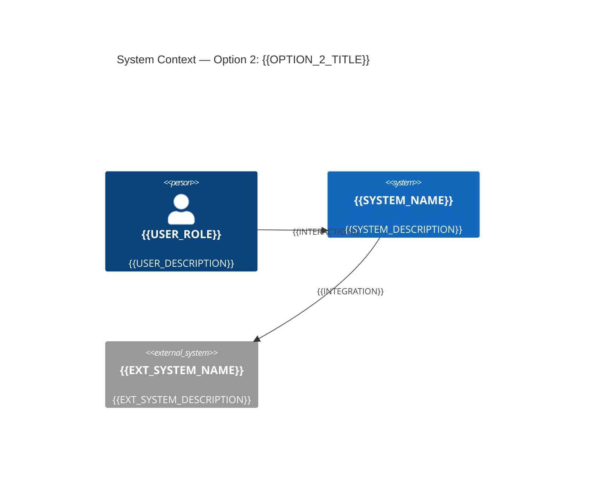

<!-- 
  ADR Template
  ⚠️ Keep in sync with: .github/copilot-instructions.md
-->
# ADR-{{NUMBER}}: {{TITLE}}

## Table of Contents

- [Version Control](#document-version)
- [Document Overview](#metadata)
- [Context](#context)
- [Decision Drivers](#decision-drivers)
- [Decision Drivers](#decision)
- [Considered Options](#considered-options)
- [Recommendation](#recommendation)
- [Consequences](#consequences)
- [Pros and Cons](#pros-and-cons)
  - [\<Option 1\>](#option-1)
  - [\<Option 2\>](#option-2)
- [Links](#links)

**Document Version:**

| Version | Date | Who | What |
|---------|------|-----|------|
| 0.1 | Jun 3, 2024 | | Draft |
| | | | |

## Metadata

| Field | Value |
|-------|-------|
| **Decision Required** | \<Problem statement described in question form\> |
| **Decision Outcome** | \<A brief summary of the outcome of the decision\> |
| **Owner** | \<The individual responsible for progressing the decision\> |
| **Domain** | |
| **Current Status** | `Proposed` / `Rejected` / `Signed Off` |
| **Deciders** | \<Everyone involved in the decision\> |

## Context
<!-- What is the issue that we're seeing that is motivating this decision or change? -->
{{CONTEXT}}

## Decision Drivers

- \<Driver 1, e.g. cost\>
- \<Driver 2, e.g. reliability\>

## Decision
<!-- What is the change that we're proposing and/or doing? -->
{{DECISION}}

## Architecture Diagram (Chosen Option)
<!-- Visualise the chosen option's architecture using Mermaid C4 System Context syntax. Keep to C4 Level 1 (System Context) unless explicitly requested otherwise. -->
```mermaid
C4Context
  title System Context — {{TITLE}}
  {{DIAGRAM}}
```

## Principles Alignment
<!-- How does this decision align with our architecture principles? Reference: [Architecture Principles](../architecture-principles.md) -->
| Principle | Alignment | Notes |
|-----------|-----------|-------|
| Cloud-First | ✅ / ⚠️ / ❌ | |
| API-First | ✅ / ⚠️ / ❌ | |
| Security by Design | ✅ / ⚠️ / ❌ | |
| Observability | ✅ / ⚠️ / ❌ | |
| Resilience | ✅ / ⚠️ / ❌ | |
| Cost Efficiency | ✅ / ⚠️ / ❌ | |
| Technology Standards | ✅ / ⚠️ / ❌ | |
| Data Management | ✅ / ⚠️ / ❌ | |

## Impacts
<!-- What areas will be impacted by this decision? -->

### Teams Impacted
{{TEAMS_IMPACTED}}

### Systems Impacted
{{SYSTEMS_IMPACTED}}

### Timeline
| Phase | Description | Duration |
|-------|-------------|----------|
| {{PHASE_1}} | {{PHASE_1_DESC}} | {{PHASE_1_DURATION}} |
| {{PHASE_2}} | {{PHASE_2_DESC}} | {{PHASE_2_DURATION}} |
| {{PHASE_3}} | {{PHASE_3_DESC}} | {{PHASE_3_DURATION}} |

### Risks
| Risk | Likelihood | Impact | Mitigation |
|------|------------|--------|------------|
| {{RISK_1}} | High/Medium/Low | High/Medium/Low | {{MITIGATION_1}} |
| {{RISK_2}} | High/Medium/Low | High/Medium/Low | {{MITIGATION_2}} |

## Consequences
<!-- What becomes easier or more difficult to do because of this change? -->

### Positive
{{POSITIVE_CONSEQUENCES}}

### Negative
{{NEGATIVE_CONSEQUENCES}}

## Alternatives Considered
<!-- One sub-section per option considered. Each option includes a C4 System Context diagram (Level 1) showing the system in scope, external actors, neighbouring systems, and their interactions. -->

### Option 1: {{OPTION_1_TITLE}}

{{OPTION_1_DESCRIPTION}}

**Pros / Cons**
- ✅ Good, because...
- ❌ Bad, because...

**C4 System Context Diagram**


### Option 2: {{OPTION_2_TITLE}}

{{OPTION_2_DESCRIPTION}}

**Pros / Cons**
- ✅ Good, because...
- ❌ Bad, because...

**C4 System Context Diagram**


## Related Decisions
<!-- List any related ADRs - add links to relevant decisions -->

| ADR | Title | Link |
|-----|-------|------|
| ADR-004 | Using Redis for Session Caching | [adr-004](../adr-docs/adr-004-using-redis-for-session-caching.md) |
| ADR-005 | New PUSH Service | [adr-005](../adr-docs/adr-005-New%20PUSH%20Service.md) |
| ADR-007 | API Gateway Selection | [adr-007](../adr-docs/adr-007-api-gateway-selection.md) |
| ADR-008 | API Versioning | [adr-008](../adr-docs/adr-008-api-versioning.md) |
| ADR-009 | API Versioning | [adr-009](../adr-docs/adr-009-api-versioning.md) |
| ADR-011 | PUSH Solution for Front-End Gamestate | [adr-011](../adr-docs/adr-011-push-solution-for-front-end-gamestate.md) |
| ADR-012 | Serverless Microservice | [adr-012](../adr-docs/adr-012-serverless-microservice.md) |
| ADR-013 | PUSH Notifications for Gamestate Updates | [adr-013](../adr-docs/adr-013-push-notifications-for-gamestate-updates.md) |
| ADR-014 | Changing PUSH to use AWS AppSync | [adr-014](../adr-docs/adr-014-changing-push-to-use-aws-appsync.md) |
| ADR-015 | Changing Kafka to SQS | [adr-015](../adr-docs/adr-015-changing-kafka-to-sqs.md) |
| ADR-016 | Changing from REST to GraphQL for React App Updates | [adr-016](../adr-docs/adr-016-changing-from-rest-to-graphql-for-react-app-updates.md) |
| ADR-017 | Implementing Event Sourcing for Audit Logs | [adr-017](../adr-docs/adr-017-implementing-event-sourcing-for-audit-logs.md) |
| ADR-018 | Replace Polling with PUSH Solution | [adr-018](../adr-docs/adr-018-replace-polling-with-push-solution.md) |
| ADR-019 | Implementing AWS AppSync for Native Notifications | [adr-019](../adr-docs/adr-019-implementing-aws-appsync-for-native-notifications.md) |
| ADR-020 | Use Real-time Updates for Gamestate | [adr-020](../adr-docs/adr-020-use-real-time-updates-for-gamestate.md) |
| ADR-021 | Replace Polling with Push for Prices | [adr-021](../adr-docs/adr-021-replace-polling-with-push-for-prices.md) |

<!-- Delete rows that are not relevant to this ADR -->

## References
<!-- Links to relevant documentation, diagrams, etc. -->
{{REFERENCES}}